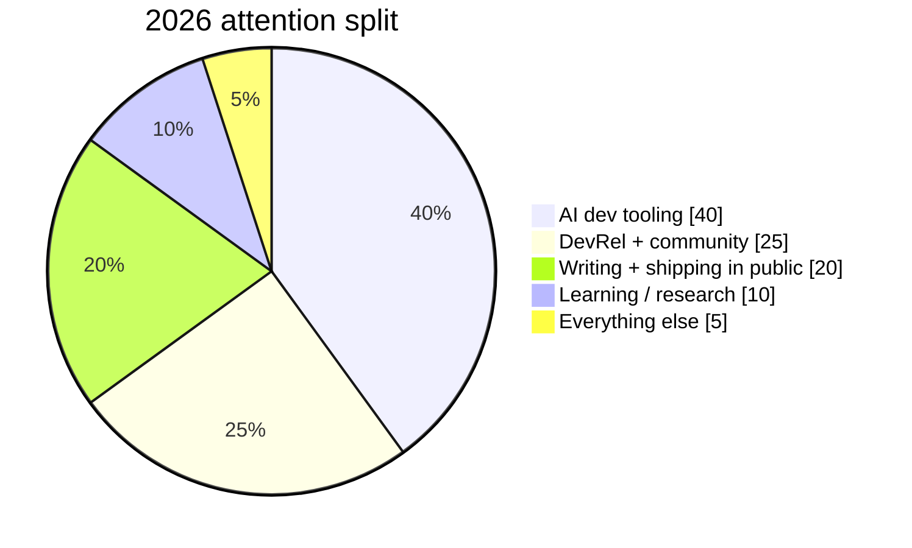

# 2026 Predictions: The Ones I'm Actually Betting On

> **TL;DR:** The "AI assistant" era ends in 2026. Autonomous pipelines take the wheel. No-code gets quietly buried. The first real AI-native B2B product category emerges, and most developer communities fracture trying to scale. These aren't vibes — I'm prepared to be publicly wrong about all of them.

Every January, the internet fills up with prediction posts that read like a horoscope written by a VC who just got back from Davos. "AI will reshape industries." "Developer experience matters more than ever." "Community is the new moat." Sure. Thanks. Very useful.

Here's what I'm actually doing differently: I'm making specific, falsifiable predictions. Ones that either happen or don't. No wiggle room. If I'm wrong, I'll write the follow-up post and own it.

Let's go.

---

## Prediction 1: The First Sub-5-Person B2B SaaS Company Hits $1M ARR Using AI as the Delivery Layer

I'm not talking about an AI *feature*. I mean a company where the product itself is delivered by an autonomous AI pipeline — and there are fewer than five humans on payroll doing anything other than sales and strategy.

This is already structurally possible. Think about what a modern B2B SaaS delivery loop actually looks like: ingest customer requirements → write code → run tests → deploy → monitor → respond to support tickets → update documentation. Every single one of those steps has an AI-native primitive available right now. Cursor for the coding layer, Playwright MCP for test execution, Vercel AI SDK for orchestration hooks, Intercom Fin or a fine-tuned GPT-4o for support.

The blocker until now has been **reliability across a multi-step agentic chain**. If step 4 of 7 fails silently, the whole thing falls apart and you get a human frantically debugging at 2am — and trust me, I've been that human (the trailing slash in the webhook was step 3, not step 4, but the pain was the same).

What changes in 2026 is better structured output guarantees from frontier models combined with retry-aware orchestration frameworks. Projects like LangGraph, CrewAI, and the emerging class of agent-reliability tooling are finally good enough to put into a critical path. The first founder who builds a narrow-enough vertical SaaS — think something like automated compliance reporting for mid-market SaaS, or AI-generated API documentation as a service — and runs it almost entirely on agents will cross $1M ARR before Q4.

**Falsifiability check:** By December 2026, I expect to be able to name at least one publicly documented company that matches this profile. If I can't, I'm wrong.

---

## Prediction 2: "Copilot Mode" Dies — AI Becomes the Primary Author, Humans Become Reviewers

The current paradigm is: developer writes code, AI suggests completions. The paradigm by end of 2026 will be: developer writes a spec or a ticket, AI writes the entire PR, and the developer reviews and merges.

This is not sci-fi. It's what tools like Devin, SWE-agent, and GitHub Copilot Workspace are already pointing at. But right now they're flaky enough that most developers use them as a curiosity rather than a core workflow. The flakiness threshold is going to cross a critical line this year.

Here's the specific signal I'm watching: the **pass@1 rate on SWE-bench Verified**. Right now the best models sit around 50-60%. When that number consistently clears 75% on the verified (not lite) benchmark, the mainstream adoption curve kicks in. I'm predicting that happens by mid-2026, and the tooling ecosystem will catch up within 6 months.

The developer's job doesn't disappear — it shifts. You'll spend more time on:

- Writing precise, unambiguous specs (prompt engineering for tickets)
- Defining acceptance criteria that an AI agent can evaluate
- Reviewing diffs with a much more critical architectural eye
- Handling the edge cases that AI genuinely can't reason about yet (novel security vulnerabilities, latency-sensitive distributed systems behavior, anything requiring "taste")

If you're a developer and you're not practicing code review as a deliberate skill right now, start. The floor of what gets auto-generated will rise faster than most people expect.

---

## Prediction 3: Multimodal Context Windows Unlock a Completely New Product Category — "Ambient Intelligence Interfaces"

Here's the one that I think is genuinely underestimated.

Long context + vision + persistent memory + real-time audio is now a coherent stack. You can build something that watches your screen, listens to your meeting, reads your codebase, and maintains a running context of what you're working on — all without a user explicitly "prompting" it.

I'm calling this category **ambient intelligence interfaces**, and I'm predicting that by end of 2026, there will be at least three VC-backed companies built entirely around this paradigm. Not copilots you invoke. Not chatbots you open. Persistent, always-on AI layers that reduce the cognitive overhead of knowledge work without you ever switching context to use them.

The technical stack that makes this real: Gemini 1.5 Pro's 2M token context (or whatever successor exists by then), screen capture APIs, WebRTC for audio, and vector stores for long-term memory that persist across sessions. The hard part isn't the AI — it's the UX. How do you design a product that's always watching without feeling creepy? The companies that solve that UX problem first will own the category.

I'm also betting that the first mainstream version of this doesn't come from a startup — it comes from Apple or Google baking it into the OS. But the startups that build for power users and developers will carve out a defensible niche before the platform players commoditize the space.

---

## Prediction 4: No-Code/Low-Code Quietly Loses Its Target Market

Bubble, Webflow, Adalo — these tools were built on a premise: coding is hard and inaccessible, so we'll let non-technical people build apps visually. That premise is structurally eroding.

The target user for no-code was always a semi-technical person who wanted to build something but couldn't write code. In 2026, that same person can describe what they want to Claude or GPT-4o and get working code — code they can actually understand, modify, and deploy. The accessibility gap that no-code was solving is shrinking fast.

This doesn't mean Webflow is dying (design-heavy marketing sites are a different category). But I'm predicting that the pure play "build an app without code" no-code tools see meaningful churn among their most active power users as those users migrate to AI-assisted coding workflows instead. The market doesn't disappear — it collapses from the top. The most capable no-code users leave first because they gain the most from AI-assisted code generation.

If you're building in the no-code space, the strategic response isn't "add AI features." It's to reposition around what AI genuinely can't replace: visual design systems, real-time collaboration, and opinionated deployment infrastructure. The product surface area narrows, but the moat deepens for what remains.

---

## Prediction 5: Developer Community Structure Fractures at Scale — Specialized Working Groups Win

We're in the "everything in one Discord" era of AI communities. A single server with 50k+ members, a dozen channels, and a firehose of messages that nobody can keep up with. It works when communities are small. It breaks at scale.

Here's what I think replaces it: **purpose-specific, invite-constrained working groups**. Smaller, more intentional, organized around a specific use case or problem space. Think 200 people who are all building agent frameworks, or 150 people deploying LLMs in regulated industries, rather than 50,000 people all generically "interested in AI."

The signal for this already exists in open source: the most productive OSS AI projects have tight async communication loops — weekly office hours, focused GitHub discussions, and deliberately limited Slack/Discord access. The contribution quality is higher, the signal-to-noise ratio is better, and onboarding has actual structure.

By the end of 2026, the highest-leverage developer communities won't be the largest ones. They'll be the ones with the highest ratio of builders to lurkers. If you're running a developer community right now, the most important metric to optimize isn't member count — it's weekly active contributors.

---

## Key Takeaways

- **The agentic B2B product is imminent**: Sub-5-person teams running near-autonomous AI delivery pipelines will hit meaningful revenue milestones in 2026. Build the operational playbook now.
- **Shift from writing code to specifying intent**: The developer who can write a precise, unambiguous technical spec will outperform the one who's fastest at implementing it. Practice the skill deliberately.
- **Ambient intelligence is the next interface paradigm**: Always-on, context-aware AI layers will emerge as a distinct product category. The UX problem is harder than the AI problem — that's where the opportunity is.
- **No-code loses its most capable users first**: The accessibility gap that no-code tools solved is narrowing. The response isn't adding AI — it's doubling down on design and deployment infrastructure.
- **Smaller, intentional communities outperform large ones**: Developer community quality compounds through focus. Stop optimizing for follower count and start optimizing for contribution rate.

---

## Frequently Asked Questions

**You keep saying "by end of 2026" — what's your confidence level on these?**

Honestly? 60-70% on most of them. The B2B agentic company one I'm most confident about because the structural ingredients already exist — it's a when, not an if. The ambient intelligence one I'm least confident about because the UX problem is genuinely hard and could delay mainstream adoption into 2027. But I'm publishing these publicly so I have skin in the game. Check back in December.

**What's the most contrarian thing here?**

Probably the no-code prediction. Most people in the space think "add AI features" is the answer. I think it's the wrong frame. The threat isn't that no-code tools fail to add AI — it's that the underlying use case (accessible app building for semi-technical people) gets solved better by AI-assisted code generation than by no-code visual builders. The tools can add all the AI they want; the market is still moving.

**What should a developer do differently based on these predictions?**

Three things: (1) Get comfortable reviewing AI-generated code at speed — this is now a core skill. (2) Practice writing tight specs and acceptance criteria, not just implementation. (3) If you're building a community, pick a specific problem space and go deep instead of broad. The era of "developer community for anyone interested in AI" as a viable positioning is ending.

---

*Subscribe — I write about startups and technology weekly.*

*— [Shantanu Vishwanadha](https://substack.com/@thecoderpanda)*

## Where I'm putting my time in 2026

