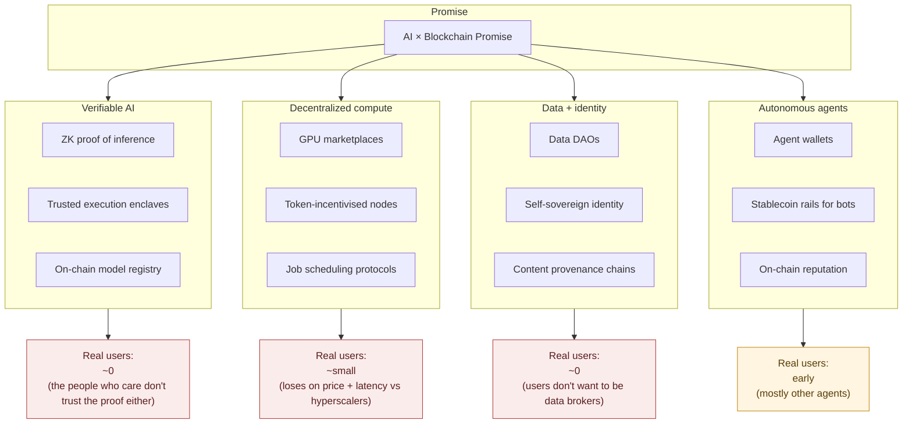

# AI + Blockchain: The Honest Postmortem

> **TL;DR:** "AI × blockchain" is one of the most funded, most pitched, least used categories in tech. The failure isn't technical — it's that nobody was asking for the thing the crossover solves. And the industry's favourite consolation prize ("but users want *sovereignty*!") is, mostly, a story we tell ourselves. Let me make the case, and then let me argue with myself.

I've spent the last few years around both worlds. I've shipped on-chain data infrastructure. I've built agentic tools. I've watched every VC deck in 2023–2025 stitch the two words together with a plus sign and a straight face.

The result is in. It didn't work. Not the way anyone said it would.

This post is the postmortem I wish someone had written a year ago, so I could have saved a few conversations.

## What "AI × blockchain" was supposed to be

Depending on which quarter's narrative you inhaled, the pitch was one of:

1. **Verifiable AI** — every model inference gets a cryptographic proof, so you can trust the output even when the model runs on a shady GPU somewhere.
2. **Decentralized compute** — GPUs pooled across strangers, coordinated by a token, undercutting AWS by 10×.
3. **Data DAOs** — users own their training data, get paid when models are trained on it.
4. **Agent-to-agent payments** — autonomous agents transact with each other using stablecoins, no human in the loop.
5. **On-chain reasoning** — LLMs that can natively read and act on smart contract state.
6. **Sovereign personal AI** — your assistant runs on your keys, your data, your device; no OpenAI, no Google, no leash.

Each of these is technically real. Each has a working demo somewhere. Each has raised real money.

None of them has a product with 10,000 daily active humans using it, unprompted, because it makes their life better.

That is the failure. Not "regulation." Not "UX." Not "we're early." The failure is: **when the tech works, the demand isn't there.**

## The stack, and where each layer stalls

Every layer has smart people, real code, and a version that runs. Every layer has, at best, a rounding-error of the demand its whitepaper predicted. The category is not held back by a single missing primitive — it's held back at every layer by the same thing: **the user problem was invented to fit the tech.**

## Why the pairing keeps failing

Four honest reasons, no hand-waving.

### 1. AI is centralising, hard, at exactly the moment the pitch requires decentralisation

The best models today are enormous, expensive to train, expensive to run, and getting more so. The economics push toward a handful of hyperscale labs. That is the opposite trajectory from every "decentralised AI" thesis, which needs the frontier to be commoditised so a swarm of nodes can host it.

Every year that Claude, GPT, and Gemini get better relative to open models, the market rationale for renting AI capacity from a token network gets weaker. The gap is not closing. The people who insist otherwise are counting parameters, not capability.

### 2. Latency and UX kill everything on-chain

An LLM call is already 1–5 seconds and users hate the wait. Adding a blockchain confirmation loop turns that into 12–30 seconds on a good day, plus a wallet popup, plus a gas conversation. The user closes the tab.

"But rollups!" — sure, and for the specific case of *payment settlement* they work. For the interactive loop of AI, they're still slower than a Stripe charge and far slower than an API key.

### 3. Verifiability solves a problem almost nobody has

The pitch: "You wouldn't run an AI you couldn't verify."

The reality: users run models they can't verify every day. They paste secrets into ChatGPT. They accept AI code review. They trust Waze. The number of consumer decisions gated on "prove to me this inference was honest" is, empirically, roughly zero.

Verifiable inference *does* matter in a few B2B contexts (regulated finance, some healthcare workflows, model marketplaces auditing sellers). But those are enterprise SaaS deals, not token-gated protocols. And they usually pick TEEs over ZK because ZK inference is still an order of magnitude too expensive for real model sizes.

### 4. The "agent economy" doesn't need a chain to work

The version of agent-to-agent payments that's actually shipping in 2026 is: agents use Stripe. Or corporate cards. Or the Anthropic Payments API. Or wire transfers via a fintech.

The stablecoin-on-a-chain version exists, has meaningful volume, and — importantly — is mostly used between *businesses that already run crypto rails*. It's not the new substrate for agent commerce; it's a payment method some agents happen to use. That's fine. It's just not a category.

## And now — the sovereignty argument

Here's where I want to pick a fight with the received wisdom, and then honestly test it against my own claim.

The most common defence I hear for AI × blockchain in 2026 is some version of:

> "But surely people want *sovereign* AI. They don't want OpenAI reading their data. They don't want a custodial assistant. They want to own their agent, their memory, their keys."

I don't think this is true at the scale people say it is. Here's why:

**People routinely trade sovereignty for convenience, and they don't feel bad about it.** They put everything in Gmail. Their photos in iCloud. Their code in GitHub. Their money in a bank. Their location in Google Maps. Their conversations in WhatsApp. Their medical records in a portal they log into once a year and forget.

Every single one of those is custodial. Every single one collects data. Every single one has a "sovereign, self-hosted, encrypted, keys-in-your-control" alternative. The self-hosted alternatives have, roughly, the users who care intensely about self-hosting. That's a real audience — it's just not a mass market.

The pattern for what people *actually* pay for is remarkably consistent:

- **Great default experience** > sovereignty
- **Predictable customer support** > sovereignty
- **Recovery from lost password** > sovereignty
- **Someone to sue if it breaks** > sovereignty
- **"It just works on my phone"** > sovereignty

Self-custody is the *engineer's* aesthetic preference. It is not the general population's. Twelve years of crypto has been a natural experiment on that question and the answer is unambiguous: the overwhelming majority of crypto value sits on exchanges, in custodial wallets, in ETFs, in wrapped-token products. When people are handed keys, they lose them, get phished, and end up back at Coinbase.

If self-sovereign *money* — the thing crypto was allegedly for — didn't win the sovereignty argument, self-sovereign *AI memory* is not going to.

### Where I'd steelman the opposing view

I want to be intellectually honest here, so let me argue against myself. There are three ways I could be wrong.

**1. Sovereignty as a floor, not a feature.** People don't demand sovereignty — until a public incident makes them. The moment a model provider is caught training on private conversations (again), or a jurisdiction blocks access to an assistant a lot of people depend on, the demand curve for local/self-hosted moves overnight. This is how privacy tooling always wins: not gradually, but in step-changes tied to news cycles.

**2. Agents change the equation.** Humans tolerate custodial services because the human is the pilot — the account, the recovery, the intent live in a body that can call support. An autonomous agent has none of those. If your agent lives on someone else's server, so does everything it does on your behalf. That may be the first mass-market use case where the sovereignty pitch actually maps onto a felt problem, because the agent-you and the biological-you are legally the same person but computationally aren't.

**3. Legal and geopolitical pressure.** GDPR forced a data-locality architecture that would have been laughed out of a Bay Area boardroom in 2010. If AI providers get treated like utilities — with mandatory data residency, mandatory model provenance, mandatory audit — a lot of "boring" blockchain infrastructure suddenly becomes attractive as a compliance substrate. Not because users demand it; because regulators do.

I take (2) most seriously. If any version of the sovereignty pitch survives, it's the agent one. It has a real mechanic underneath it — not aesthetics.

## So what did the crossover actually produce?

Being fair to the space, three things came out of the AI + blockchain era that will outlast the narrative:

- **Content provenance standards** (C2PA and cousins). Not on a public chain, but the mental model — sign everything, verify origin — is directly downstream of the "sign every inference" pitch. It's shipping in cameras and browsers in 2026.
- **A meaningful stablecoin rail for machine-to-machine payments** between businesses that already trust each other. Small, real, unsexy. Not the tokenized-agent-economy people pitched, but useful.
- **Model marketplaces with reputation and audit** — not on-chain, mostly on Hugging Face and enterprise MLOps platforms. But the primitive of "there is a public record of what this model is, who trained it, and what it's been benchmarked on" is close to what the on-chain crowd wanted.

That's a real, if modest, legacy. It's just not the trillion-dollar category the decks projected.

## The rule I'd extract for the next narrative

Whenever two hot categories are being welded together with a plus sign, ask one question and don't accept a hand-wave:

> *"Which specific person, at which specific moment in their day, has a problem this pairing solves that they couldn't solve with either half alone?"*

If the honest answer is "protocol engineers," "arbitrageurs," or "our own portfolio companies" — the pairing is a slide, not a market.

Applied to AI × blockchain, the honest answer was almost always some flavour of "regulated enterprises might want this eventually." That was true. It was also not enough demand to justify the amount of capital, headcount, and narrative bandwidth spent on it.

Applied to the next one — AI × robotics, AI × biotech, AI × education — the same question is going to sort winners from theatre very quickly.

## Debate me

I've made three strong claims:

1. AI × blockchain is a failure as a *user-facing* category, not just as a "we're early" one.
2. Sovereignty is an engineer's value, not a mass-market value, and the market has been telling us so for twelve years.
3. The one exception worth taking seriously is autonomous agents, where sovereignty maps onto a genuine mechanical problem instead of an aesthetic preference.

If you think I'm wrong on any of these — especially the sovereignty one — I want to hear it. Post a rebuttal, tag me, or write it up and send me the link. The best case for a thesis is the one that survives smart people trying to break it.

---

*More opinion pieces at [thecoderpanda.com/blog](https://thecoderpanda.com/blog).*
