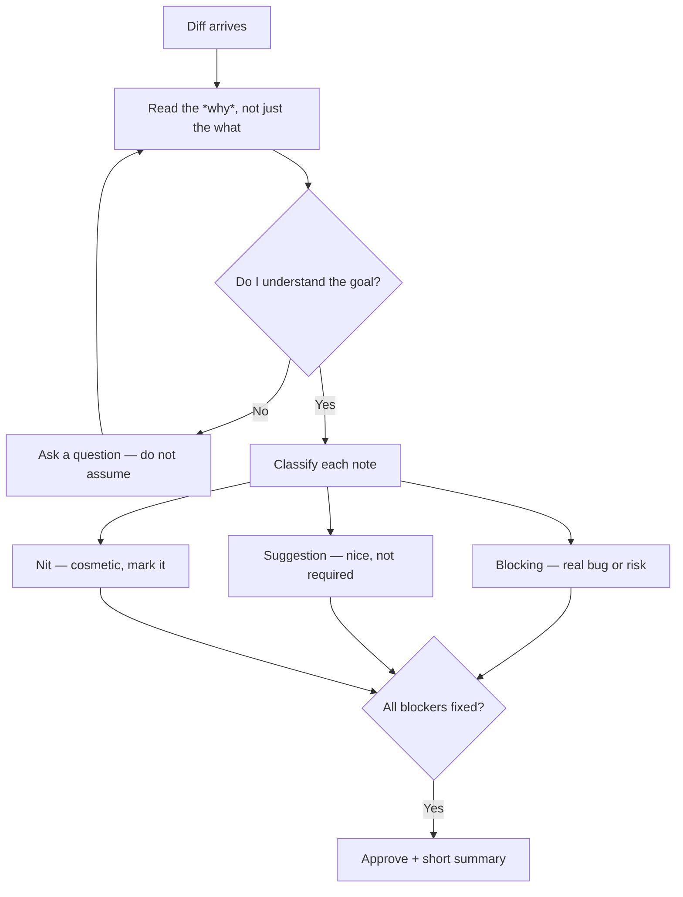

# The Art of the Code Review: How to Give Feedback Developers Actually Appreciate

> **TL;DR:** Code reviews are often treated as a playground for pedantry and power struggles, destroying team morale and velocity. By shifting from petty nitpicking to high-context collaborative feedback, separating style from logic, and treating reviews as a tool for shared learning, you can turn pull requests into your team's greatest educational asset.

There is a specific, cold dread that every developer knows. It is the notification that says: *"Your Pull Request has been reviewed with 47 comments."* You open it, hoping for deep architectural insights, only to find a wall of pedantic nitpicks about indentation, minor naming choices, and academic debates over single-line optimizations that save three nanoseconds of CPU time on an API that is called twice a day.

This is not software engineering; it is an interrogation disguised as quality assurance. Somewhere along the line, we forgot that the primary goal of a code review is not to show off how smart we are, but to ensure code correctness, share knowledge, and ship value to our users. When code reviews become battlegrounds for developer egos, everyone loses. The author becomes defensive, the reviewer gets frustrated, and shipping velocity grinds to a halt. It is time to reform our review culture and learn how to give feedback that engineers actually respect and look forward to receiving.

## Separation of Church and State: Let the Linters Do the Nitpicking

If you are wasting human cognitive energy pointing out formatting inconsistencies, missing semicolons, or minor syntax choices, your engineering organization has failed to set up proper tooling. A human being should never have to comment on code formatting in a pull request.

This is what automated linters, formatters, and static analysis tools are for. Set up tools like ESLint, Prettier, or Ruff in a pre-commit hook or as a continuous integration (CI) blocking check. If the code does not conform to your team's style guide, the CI build should fail before a human ever lays eyes on the code. This completely removes the personal friction from code reviews. When an automated bot says "this indentation is wrong," developers fix it without emotion. When a senior peer says it, it can feel like micromanagement. Free your brainpower to focus on the things a machine cannot see: architectural soundness, security risks, logical edge cases, and maintainability.

## The Power of Context and Tone: Why, Not Just What

The most common mistake reviewers make is leaving flat, directive comments without any context. Writing "rename this variable to userObj" or "use a ternary operator here" is lazy and condescending. It reads like a list of demands rather than a collaboration.

If you are suggesting a change, take thirty seconds to explain **why** it matters. Compare these two comments:
- *Bad*: "Use map instead of forEach here."
- *Better*: "Using map here is preferable because you are transforming the array into a new format, which makes the function pure and easier to test, rather than relying on mutating an external state variable."

The second comment is not just a request; it is a lesson. It explains the underlying software design principle (purity, testability) behind the suggestion. By providing context, you turn a potentially annoying edit into a valuable teaching moment. Even if the author disagrees with your suggestion, you have opened a constructive, high-level technical dialogue rather than a petty debate.

## Categorize Your Comments: Essential vs. Optional

Every comment in a code review is not of equal importance. A critical security vulnerability that could compromise user data is infinitely more important than a minor suggestion to refactor a utility function for readability. Yet, in most pull requests, these comments look exactly the same.

To solve this, introduce a clear taxonomy for your comments. Use prefix labels to explicitly state the severity of your feedback:
- **[BLOCKER]**: This is a critical issue (e.g., security bug, logical error, major architectural flaw) that must be resolved before the pull request can be merged.
- **[CHORE]**: A minor, required change that does not affect the core logic but is necessary for code hygiene (e.g., dead code removal, outdated comments).
- **[SUGGESTION]**: A non-blocking idea for improvement (e.g., refactoring for cleaner design, slightly better naming). The author is free to implement it or merge without it.
- **[QUESTION]**: A genuine question to understand the author's design decision, not a hidden criticism.
- **[NIT]**: A highly cosmetic, optional comment (e.g., minor wording tweak in a console log).

When you label your comments, you give the author the autonomy to make decisions. They can merge the pull request while ignoring the nits and suggestions, saving valuable engineering hours and keeping team momentum high.

## Key Takeaways
- **Automate the cosmetics**: Implement pre-commit hooks, linters, and style checkers so humans never waste cognitive energy on formatting.
- **Provide deep technical context**: Always explain the underlying software principles behind your suggestions so reviews double as mentorship.
- **Label feedback by severity**: Use clear prefixes like [BLOCKER] or [SUGGESTION] to communicate what must be changed versus what is optional.
- **Celebrate excellent code**: Use code reviews to praise elegant solutions and clean implementations, not just to point out flaws.

## Frequently Asked Questions

**Q: How do we prevent code reviews from dragging on for days?**
A: Set a strict "pull request size limit" (e.g., under 400 lines of code) and a "24-hour review turnaround" SLA. Small pull requests are significantly faster to review, have higher quality feedback, and are much easier to merge without introducing regressions.

**Q: What should we do when a reviewer and author get stuck in an endless comment thread?**
A: If a discussion goes back and forth more than three times, stop typing. Jump on a quick five-minute call or talk in-person to resolve the issue. Written communication is terrible for resolving nuanced technical disagreements; a quick verbal sync saves hours of frustration.

**Q: How can we encourage junior developers to perform code reviews?**
A: Normalize the idea that anyone can review any pull request. Encourage junior team members to leave questions [QUESTION] in reviews. Reviewing code is one of the fastest ways to learn a codebase, and asking "why did you choose this pattern?" provides immense value to both parties.

---

*Bear markets are where the real builders are found. Subscribe for weekly reality checks.*

*— [Shantanu Vishwanadha](https://substack.com/@thecoderpanda)*

## A useful review, drawn

