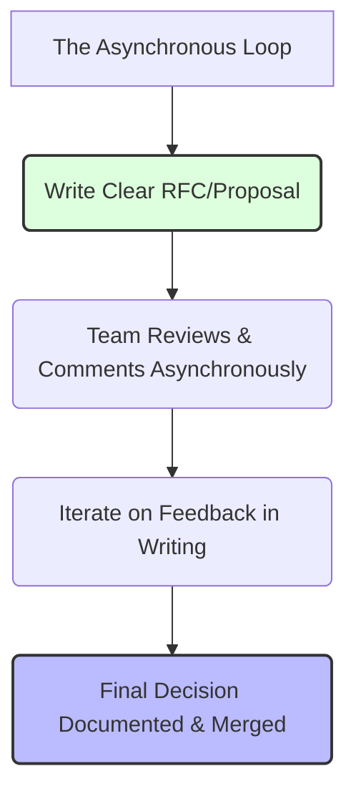

# Async Communication is an Engineering Superpower

> **TL;DR:** High-performing engineering cultures aren't built on 30-minute Zoom standups and constant Slack pings. They are built on asynchronous systems where writing is a core skill, architectural decisions live in RFCs, and developers are trusted to work deeply without constant real-time interruptions.

We are nearly a year into the global shift to remote work, and let’s be honest: most software teams are still miserable. 

They thought working remotely meant taking their existing office habits and dragging them onto Zoom. Instead of walking over to someone's desk, they ping them on Slack. Instead of hallway chats, they schedule 30-minute meetings. 

The result? Developers are spending six hours a day in video calls and then staying up until midnight to actually write code because their daytime hours were completely eaten by meetings. 

This isn't remote work. It is synchronous office culture with a worse commute (from the bedroom to the kitchen table). 

To build a high-velocity engineering organization, you have to treat **asynchronous communication** as your default setting. It isn’t a temporary workaround for a global pandemic; it is a fundamental superpower that lets your team write better code, make more deliberate architectural decisions, and achieve true, uninterrupted flow.

---

## The Meeting as a Default is a Sign of Failure

Every time you schedule a meeting, you are making a confession: you are admitting that you could not articulate your thoughts in writing well enough to get a decision made without forcing five other people to stop what they are doing and listen to you talk in real-time.

Meetings are incredibly expensive. 

If you put six senior engineers in a room for an hour, that meeting didn't cost "one hour." It cost six hours of highly specialized engineering time, plus another three hours of lost productivity as those engineers try to rebuild their mental context after the meeting ends. 

In software development, context-switching is a performance killer. It takes a developer an average of twenty minutes to get back into "the zone" after being interrupted. If you slice a developer’s day into 30-minute blocks between meetings, you are effectively ensuring they write zero high-quality code that day.

On a highly asynchronous team, meetings are the *last resort*, not the first option. You only schedule a sync when:
1. You have already tried to resolve the issue in writing and reached an impasse.
2. The topic is highly emotional or sensitive (like a 1-on-1 performance review).
3. There is a production-halting disaster at 2:00 AM.

---

## Writing is a Core Engineering Skill

In the traditional tech hierarchy, we evaluate engineers based on their programming syntax, their database tuning, and their API design. We rarely evaluate them on their writing. 

This is a massive mistake. 

In a remote-first, asynchronous company, **writing is the most important skill an engineer can have**. Your ability to write clear, concise, and structured English directly dictates your impact on the organization.

If you cannot write a clear explanation of how your system works, your teammates won't understand it, your API will be hard to integrate, and your code reviews will drag on for days.

Let's look at the difference between a poor async message and a great one:

- **The Bad Ping**: *"Hey, is the user service broken? I'm getting errors."*
  - Why it's bad: It contains zero context. It forces the recipient to ask clarifying questions in real-time, dragging both parties into a synchronous thread.
- **The Great Async Message**: *"Hey, I'm seeing an `HTTP 500` error when calling `POST /v1/users` with the payload attached below. I suspect it's related to the database migration from yesterday because of this stack trace from the logs [link]. I’ve already tried rolling back my local Docker container, but the issue persists. No rush, but let me know if you’ve seen this before."*
  - Why it's great: It contains all the necessary context. The recipient can investigate, resolve the issue, and reply with a complete solution without a single real-time conversation.

---

## Designing Async Decisions: The Art of the RFC

How do you make big, complex technical decisions without sitting in a conference room for three hours? You write a **Request for Comments (RFC)**.

At our startup, before we write a single line of code for a major feature or architectural change, we write an RFC document. The template is simple:
1. **The Context**: What is the problem we are trying to solve? Why now?
2. **The Proposed Solution**: Detailed explanation of the architectural approach, including database schemas, third-party libraries, and system dependencies.
3. **Alternative Solutions Considered**: Why did we choose this approach instead of Option B or Option C? (This is critical—it prevents the team from rehashing the same debates over and over).
4. **Drawbacks**: What are the risks? How does this increase system complexity or technical debt?

Once the RFC is written, we share it with the engineering team with a simple deadline: "Comments close next Thursday at 5:00 PM."

Engineers can read the document, process the details on their own schedule, run their own experiments, and leave structured comments directly on the doc. The author can respond to comments asynchronously. By the time the deadline hits, the trade-offs have been fully analyzed, the team is aligned, and we have a permanent, searchable record of *why* we made that decision.

---

## When Sync Actually Wins (The 2:00 AM Outage Rule)

Let's not be dogmatic. Asynchronous communication is amazing for building, planning, and documenting, but it is terrible for emergencies. 

If your primary production database is down, your API is throwing 500 errors, and your checkout page is broken, do not write an RFC. Do not start an async discussion thread in Slack. 

This is the one scenario where you go 100% synchronous. 

You fire up a Zoom bridge, get the core on-call engineers on the line, share screens, and pair-program until the system is stable. High-bandwidth, real-time collaboration is the fastest way to debug a live disaster. 

But here’s the key: the moment the outage is resolved and the systems are green, you immediately switch back to async mode. You write a public post-mortem document explaining what happened, why it happened, and how to prevent it, and you share it with the team.

---

## Key Takeaways

- **Protect Deep Work**: Guard your engineers' calendars from meeting sprawl. If a meeting doesn't have a written agenda, decline it.
- **Write for Clarity**: Shift the burden of context to the sender. Include logs, code snippets, and specific questions in your async messages.
- **Adopt RFCs early**: Make technical design docs your default way of making architectural decisions.

---

## Frequently Asked Questions

**Q: Doesn't async communication take longer to reach a decision?**
A: In the short term, yes. A meeting can get a quick consensus in 30 minutes. But that consensus is often shallow, exclusionary, and poorly thought out. An async RFC process might take a week, but the resulting decision is vastly higher quality, fully documented, and has deep buy-in from the entire team. Slow down to speed up.

**Q: How do we prevent developers from feeling isolated in a highly async culture?**
A: Async doesn't mean antisocial. We maintain social channels in Slack, run weekly informal "coffee chats" (optional), and gather in-person once a year. By reducing work-related meeting overhead, we free up energy for genuine, high-quality human connection.

---

*If this made you think, it'll do even more when shared. Hit that subscribe button — I write about async engineering and startup culture every week.*

*— [Shantanu Vishwanadha](https://substack.com/@thecoderpanda)*
