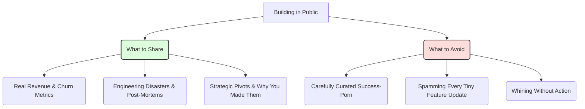

# Building in Public: The Honest Guide (Not the Instagram Version)

> **TL;DR:** Building in public is not about performing success; it’s about sharing progress. If you only post when your charts are going up and to the right, you are not building in public—you are just doing PR. True building in public is sharing your mistakes, your pivots, and your raw metrics so people can invest in your journey.

Take a stroll through Twitter, LinkedIn, or Indie Hackers today, and you’ll see everyone claiming they are "building in public." 

Most of them are lying. 

What they are actually doing is performance marketing. They post carefully curated screenshots of their Stripe dashboards showing a 400% spike in MRR (Monthly Recurring Revenue), but conveniently omit the fact that they spent $10,000 on Facebook ads to get that $500 of recurring revenue. They talk about their "lessons learned" from a failed launch, but frame the failure in a way that makes them look like a misunderstood genius.

This is "Instagram-style" building in public: success porn masked as transparency. It’s toxic, it’s fake, and it’s incredibly boring.

Real building in public is gritty. It is uncomfortable. It means showing your raw code, your dumb mistakes, your churn metrics, and your bad days. It means admitting when you don't know what you're doing, and inviting your community to watch you figure it out. 

If you do it right, building in public is the most powerful organic growth engine a startup can have. If you do it wrong, you are just noise in an already crowded feed. Let’s talk about how to do it honestly.

---

## Why Performance Marketing Fails (And Why Transparency Wins)

We are living in an era of peak marketing fatigue. Customers, especially developers and technical founders, have developed an incredibly high immunity to traditional sales pitches. They don't buy "We are the leading platform for X." They roll their eyes when they see press releases about venture rounds or buzzword-filled landing pages.

Authenticity, however, is still incredibly scarce. 

When you share your actual journey, you bypass the consumer’s marketing filter. People stop viewing you as a company trying to extract money from their wallets, and start viewing you as a human being trying to solve a hard problem. 

They begin to root for you. They become emotionally invested in your success. When you eventually launch a new feature, they don't just see a product update—they see the culmination of weeks of hard work they watched you struggle through. They aren't just customers anymore; they are advocates.

---

## What to Actually Share (Show the Scars, Not Just the Tattoos)

To build a real, engaged audience, you have to share things that have educational or entertainment value. High-quality transparency is about sharing things that others can learn from.

Here is a checklist of what you should actually be sharing:

1. **The Numbers (The Good, the Bad, and the Ugly)**: Don't just share your active user count. Share your churn rate. Share your customer acquisition cost (CAC) vs. your lifetime value (LTV). If you lost three major customers last week, talk about why they left and what you are doing to fix the product gap.
2. **The Disasters**: Did you run a migration script that accidentally dropped a production database table? (I've been there, it’s terrifying). Write a detailed post-mortem. Explain exactly how it happened, how you recovered the data, and what safeguards you’ve put in place to ensure it never happens again. Developers *love* reading engineering disaster stories. It’s highly educational and shows deep humility.
3. **The Strategic Decisions**: If you decide to pivot your product, change your pricing tiers, or sunset a popular feature, don't just announce it. Share your internal decision-making process. Walk people through the data, the customer feedback, and the trade-offs you wrestled with before making the call.

---

## How to Handle Bad Days Publicly

One of the biggest anxieties founders have about building in public is: "What if I look incompetent?" 

Here is the secret: **vulnerability is a strength, not a weakness**. 

Admitting you made a mistake or that you are struggling with a hard technical problem doesn't make you look weak; it makes you look human. It builds immense trust.

However, there is a fine line between authentic vulnerability and unproductive whining. When you share a bad day, always frame it with **agency and action**.

- **Bad Whining**: "Nothing is working, our server keeps crashing, I hate web development, I want to quit."
- **Authentic Vulnerability**: "Our database CPU spiked to 100% today, causing a 20-minute outage for our early users. Here is the query that caused it, how we temporarily patched it, and our plan to migrate to a better indexing strategy tomorrow."

See the difference? The second approach acknowledges the pain and the mistake, but takes full responsibility and outlines a clear path forward. It turns a negative event into an educational case study.

---

## Specific Tactics for Sustainable Transparency

Building in public is exhausting if you treat it as an extra chore. The key to consistency is to integrate it into your daily work.

- **The Weekly Retrospective**: Every Friday, write a quick summary of what you shipped, what you broke, what you learned, and how your metrics changed. Keep it simple and structured.
- **The "Behind the Scenes" Snippets**: Screenshot your code editor, your database migrations, or your Figma designs. Share the raw, messy work-in-progress.
- **Build a Dedicated Channel**: Use Substack, a dedicated blog page, or an email list. Don't rely solely on social media algorithms to reach your audience. Own your distribution.

---

## What Building in Public is NOT Good For

Let’s be realistic: building in public is not a silver bullet. It has limitations.

It is **not** a replacement for product-market fit. If you are building a product that nobody wants, sharing your journey won't make them want it. It will just build an audience of people watching you build a useless product.

It is **not** good for protecting intellectual property. If you are building a highly proprietary, easily-copied algorithmic product, showing your exact code might not be the smartest move. (Though, in 95% of software startups, execution and distribution are the real competitive moats, not the code itself).

Finally, it is **not** a fast process. It takes months of consistent, honest sharing before you see the compounding effects. If you expect a flood of signups from your first three posts, you will be disappointed.

---

## Key Takeaways

- **Ditch the Vanity**: If you only share wins, you are doing PR, not building in public.
- **Provide Educational Value**: Make your updates useful to the reader, not just self-promotional.
- **Focus on Action**: When things break, explain how you are fixing them. Turn failures into case studies.

---

## Frequently Asked Questions

**Q: Won't our competitors copy our ideas if we share them?**
A: If your only competitive advantage is that your competitors don't know what you're doing, you don't have a real business. Execution speed, customer empathy, and community trust are what actually win markets. Competitors can copy your features, but they can't copy your relationship with your audience.

**Q: I'm a quiet developer, I don't like posting selfies or self-promoting. Can I still build in public?**
A: Yes! Building in public is not about lifestyle vlogging. It’s about sharing your *work*. You don't need to post photos of yourself. Post screenshots of code, write about why a specific library didn't work for you, or share your terminal commands. Let the work do the talking.

---

*If this made you think, it'll do even more when shared. Hit that subscribe button — I write about startups, transparent building, and product strategy every week.*

*— [Shantanu Vishwanadha](https://substack.com/@thecoderpanda)*
