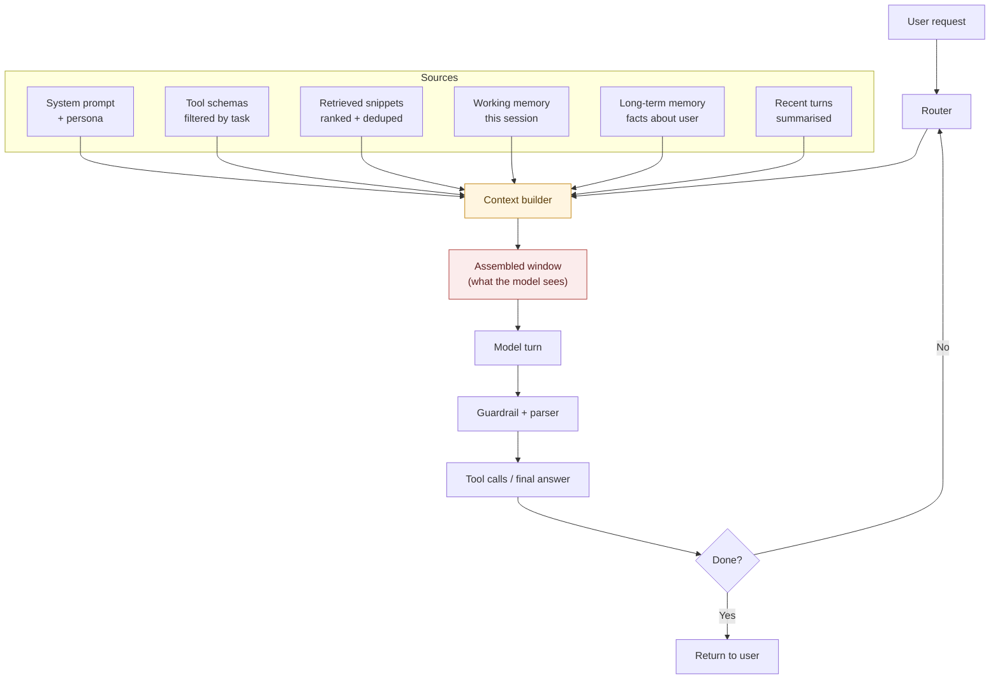

# Context Engineering Ate Prompt Engineering

> **TL;DR:** "Prompt engineer" was a real job for about eighteen months. It's gone. Not because prompting stopped mattering, but because the surface area of what a model needs to do something useful exploded — from a paragraph of instructions to a live, curated stream of tools, memory, retrieval, guardrails, and evals. The people quietly winning in 2026 aren't prompt-crafters. They're the ones who understand that everything the model sees, in order, is the product. That discipline needs a better name than "prompt engineering," and it's already outgrown it.

Three years ago, LinkedIn was full of "prompt engineer" postings at $200K–$400K. There were courses. There were certifications. There was a whole cottage industry of prompt libraries, prompt marketplaces, prompt debuggers.

Search LinkedIn today. That job barely exists.

What happened isn't that prompts stopped mattering. It's that the useful unit of work stopped being *the prompt* and started being *everything the model sees in a turn* — and everything it sees is now dynamically assembled by code, not written by a human in a text box.

That's context engineering. And it's a bigger, harder, more valuable discipline than prompt engineering ever was.

## The lie in the phrase "prompt engineering"

The idea of "prompt engineering" was always slightly off. It implied that the leverage was in the wording — that the difference between a bad output and a good one was a clever turn of phrase, a magic incantation, "Let's think step by step."

For GPT-3.5 in 2023, that was almost true. The model was small enough, the tools were absent, the context window was 4K tokens, and the whole system was: user text in, model text out. Prompt-as-product made sense.

By 2026, the same conversation has:

- 200K–1M token context windows.
- Twenty or more tools the model can call, each with its own schema and its own failure modes.
- A retrieval layer pulling snippets from a vector store, a code index, and a live database.
- A memory layer surfacing what the user said three days ago.
- A guardrail layer intercepting outputs before they leave.
- Multiple sub-agents, each with their own context, calling this model as a subroutine.
- Structured output constraints (JSON schema, tool calls, grammar-constrained decoding).

The "prompt" — the thing a human wrote — is 3% of what the model actually reads on any given turn. The other 97% is *assembled programmatically, at runtime, from a dozen sources, in a specific order, by an engineer who thought hard about what should be in that window and what shouldn't.*

That engineering is the work. The wording is a rounding error on top of it.

## What context engineering actually is

Here's the shape of the real job:

Every arrow into "context builder" is a decision. Every decision has to be made *automatically, cheaply, and correctly, per turn*.

- **Which tools to expose?** Give the model all 40, and it forgets half of them and hallucinates the schemas of the rest. Give it 4, and it fails at anything outside that lane. Somewhere between is a routing problem.
- **Which snippets to retrieve?** Vector similarity is a start. It's not a solution. Rerank. Deduplicate. Drop anything the model has seen this session.
- **Which memory to surface?** The user said "call my brother-in-law" three days ago. That fact is either helpful now or a red herring. Deciding is a whole model call.
- **How to compress recent turns?** Full transcripts blow the window in ten turns. Summarising loses the specific detail that mattered. Selective retention is an art.
- **What order?** Yes, order matters. Models are still lossy about the middle. A tool schema at position 12,000 is basically not there.

None of this is prompt engineering. All of it is context engineering.

## Why the field pretended this wasn't a thing

For a couple of years, the vendors sold a story: "just prompt the model." It made the API feel simple. It let the launch demo be a single text box.

That story served the vendors. It didn't serve builders. Because the builders were quietly assembling half a dozen pipelines to make the demo actually hold up in production, and calling the whole assembly a "prompt" was a category error.

The industry has finally caught up to what practitioners were doing all along:

- Anthropic ships a "context management" API in the SDK — not a "prompt" API.
- OpenAI's Responses API has separate slots for instructions, tools, retrieved documents, and prior state.
- Every serious agent framework — LangGraph, Mastra, dspy, whatever wins next quarter — is fundamentally a context-management framework wearing a prompt-engineering costume.
- The best-selling "AI engineering" books in 2026 are 20% about prompting and 80% about retrieval, tool design, evals, and pipeline shape.

The renaming is happening in slow motion. But it's happening.

## What actually separates good context engineering from bad

I've watched a lot of teams try to ship agentic products in the last eighteen months. The ones who succeed do a small number of specific things — none of which are "write a clever prompt."

**1. They aggressively delete from context.** The instinct is to add. Add more examples, add more tool docs, add more retrieved snippets, add more system prompt. The good teams do the opposite: they measure whether each thing they add is actually being *read* by the model — attention analysis, ablation evals — and delete everything that isn't earning its slot.

**2. They design tools for the model, not for the developer.** A tool called `getUserData(userId)` returning a 40-field JSON object is a developer's tool. A tool called `getUserSubscriptionStatus(userId)` returning `"active" | "past_due" | "cancelled"` is the model's tool. The narrower and more purposeful the tool, the higher the success rate. Every extra field on a return object is a chance for the model to fixate on the wrong one.

**3. They separate the "how to do the task" from the "what the task is."** System instructions describe capability. User context describes intent. Retrieved snippets describe facts. When teams collapse all three into one giant blob of "prompt," the model can't tell what's a rule, what's an example, and what's a hint. The output degrades in ways that look random until you separate the layers.

**4. They evaluate the assembled context, not just the model's output.** If your eval only looks at the final answer, you can't tell whether the answer was bad because the context was wrong or because the model was wrong. The good teams check both — often by dumping the exact assembled context, per failing turn, and having a smaller model or a human triage whether the model *could have* answered correctly from what it was given.

**5. They budget tokens like money.** Context windows keep growing — 200K, 1M, 2M — and the instinct is to fill them. Bad idea. Latency scales with context length. Cost scales with context length. And model attention gets worse at the boundaries. The teams shipping fast, cheap, reliable products treat every token like it's 3¢, whether or not it currently is.

## The uncomfortable implication for hiring

If you're building an AI product in 2026, the job you're hiring for probably isn't the job on the JD.

The JD says "LLM engineer" or "AI engineer" or, worse, "prompt engineer." It lists Python, some framework, "experience with GPT / Claude / Gemini APIs." Maybe RAG.

The job you actually need done is closer to:

- Systems thinking (this is a pipeline, not a prompt).
- Information retrieval fundamentals (yes, still — BM25, rerankers, chunking, dedup).
- Distributed tracing (you cannot debug an agent without one).
- Eval discipline (offline evals, online evals, regression sets, LLM-as-judge with human calibration).
- Product taste (deciding which tool to expose is a *product* call, not a technical one).
- Enough ML sensibility to know when you're pattern-matching and when you're not.

That is not the same person as a good Python engineer who "gets" LLMs. It's a specific composite skill, and the market for it is undersupplied by roughly a factor of ten.

The companies that quietly ship reliable AI products in 2026 have this person on the team, usually not with that title. The companies whose demos look great and whose production numbers are grim don't.

## Where prompt engineering still matters (a little)

I don't want to over-swing. Prompt-craft still matters in three places:

- **The system prompt for the outer agent.** A few hundred tokens of well-chosen instructions still moves numbers. It's just not most of the work.
- **Tool descriptions.** How you describe a tool to the model determines whether the model uses it correctly. This is prompt engineering, wearing a tool-doc costume.
- **Evaluator prompts.** When you use an LLM to grade another LLM, the wording of the grading prompt is a bigger deal than most teams realise.

Those three combined are maybe 10% of the actual craft. The other 90% is the pipeline.

## The rule I'd give a new AI engineer in 2026

If you're starting an AI product now, the temptation is to iterate on the prompt because it's the most visible, tweakable thing. Resist it.

> *Iterate on what the model sees, not what you say to it. Every turn, ask: "of the tokens the model just read, which ones changed the answer, and which were noise?" Delete the noise. Then, and only then, adjust the wording of what's left.*

That's the whole discipline in one sentence. It's boring. It's not a course you can sell in three days. It doesn't fit on a résumé line. Which is probably why it's underpriced.

## Debate me

Two claims I'm making, on purpose, more strongly than the consensus:

1. **"Prompt engineer" as a role is dead, and it was always somewhat fictional. The field has been context engineering the whole time, and only the naming has caught up.**
2. **The AI-product bottleneck in 2026 isn't model capability. It's the discipline of assembling the right window for a model that's already smart enough.** Every "we need a better model" post-mortem I've seen this year turned out, on inspection, to be a "we needed a better retrieval + tool + eval pipeline" post-mortem in disguise.

I know engineers who'll disagree with (1) — they'll say the wording still matters more than I'm giving credit for. I know research folks who'll disagree with (2) — they'll point at cases where a new model unlocked something no amount of pipeline work could.

Both are reasonable. I still think the direction is what I said. Tell me where I'm wrong.

---

*More opinion pieces at [thecoderpanda.com/blog](https://thecoderpanda.com/blog).*
