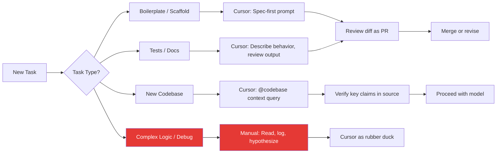

# Cursor Changed How I Code. Six Months Later, Here's the Honest Truth.

> **TL;DR:** Cursor made me meaningfully faster on the tasks that used to eat disproportionate time — new codebases, boilerplate, tests, refactors. It didn't make me faster at the things that actually require thinking. The unexpected part: it changed the skill I need most. I need to read code faster, review AI diffs critically, and write better specs — none of which I had to practice before.

---

## Six Months of Real Usage — The Context

I want to be upfront about what "six months of Cursor" means in my case. I'm not a full-time FAANG engineer maintaining a single massive codebase. I'm a developer and founder — context-switching between my own projects, open source contributions, client consulting, and building out tools for a developer community. That means I'm constantly encountering new codebases, unfamiliar stacks, and tasks that span from greenfield features to "why is this production bug happening at 2am."

That context matters because Cursor's value is not uniform across all work types. Some things got dramatically faster. Some things got mildly faster. Some things are still exactly as hard or harder than before.

I'm going to be specific.

---

## What Genuinely Got Faster

**New codebase onboarding.** This is the single biggest win and it's not close. Before Cursor, picking up an unfamiliar codebase meant 30-60 minutes of reading directory structures, tracing entry points, reading READMEs, and mentally building a model of "how does data flow through this system." With Cursor's `@codebase` context and a well-phrased question — "How does authentication work in this app? Walk me through the token validation flow." — I can get a solid mental model in 5-10 minutes. It's not perfect. It sometimes gets the data flow subtly wrong. But it gets me to "good enough to be dangerous" dramatically faster, and I can verify the specifics as I work.

**Boilerplate and scaffolding.** Writing a new API endpoint, a new React component with the right patterns for a codebase, a new database migration following existing conventions — these tasks used to require me to find a similar existing example, copy it, and adapt it carefully. Cursor does this in seconds and does it correctly most of the time if I give it clear context: "@codebase I need a new REST endpoint for creating a user invitation following the same pattern as the existing `create_project` endpoint." The output is usually 90% right and needs a quick review pass.

**Test writing.** I used to procrastinate writing tests. Part of that was friction — setting up the test structure, writing the scaffolding, finding the right assertion syntax. Cursor writes tests faster than I would write the docstring describing what needs testing. Tell it "write unit tests for this function covering edge cases including null inputs, empty arrays, and the error path" and it produces a solid test file. I still read every test it writes and occasionally fix edge cases it missed. But the blank-page problem is gone.

**Targeted refactors.** "Rename this variable across the codebase." "Refactor these three functions to use the new shared utility I just wrote." "Convert all these callbacks to async/await." These used to be careful, multi-file find-and-replace operations with high cognitive overhead. Cursor handles them quickly and correctly, and the diff review takes less time than the refactor would have.

---

## What's Still Painful (And Cursor Doesn't Really Help)

**Complex debugging.** When something is broken in a way that requires understanding why a system is behaving unexpectedly — not "the syntax is wrong" but "the data transformation three layers upstream is producing incorrect state that only manifests under specific conditions" — Cursor provides suggestions, but they're often wrong in subtle ways. The model is reasoning about the code structure it can see, not about the runtime state it can't observe. I still do real debugging the old way: logging intermediate state, reading stack traces carefully, forming and testing hypotheses. Cursor hasn't changed this at all.

**Architecture decisions.** When I'm designing a new system, deciding how components should relate, choosing patterns that will scale, or anticipating failure modes — I don't use Cursor for this. It'll generate something that looks architecturally correct but isn't informed by the specific constraints of my system, my team's capabilities, my performance requirements, or my operational complexity tolerance. Architecture decisions require judgment informed by context that the model doesn't have access to. It can help me think by prompting me with options, but the decision is mine.

**Domain-specific logic.** If I'm writing code in a domain with complex business rules — financial calculations with regulatory constraints, healthcare data handling with compliance requirements, anything with deep domain-specific invariants — Cursor can write syntactically correct code that is semantically wrong in ways that require domain expertise to catch. This is genuinely dangerous if you're not reading carefully.

**Debugging Cursor's own suggestions.** Sometimes Cursor introduces a subtle bug in its generated code. A slightly wrong type, an off-by-one, a function that works for the happy path but fails on null input. Because the code was generated quickly and looks plausible, my brain is tempted to accept it without full scrutiny. I've learned to review AI-generated diffs with the same (actually, slightly higher) skepticism I'd apply to a junior developer's PR.

---

## The Workflow Patterns That Emerged

After six months, my workflow has genuinely changed shape. These are the patterns I've settled into that make the tool actually work:

**Spec-first prompting.** The quality of Cursor's output is almost entirely determined by the quality of my prompt. Vague request, mediocre output. Precise spec, excellent output. I've started writing better mini-specs before I prompt: the function signature I want, the edge cases it needs to handle, the patterns it should follow from the codebase, what it should NOT do. This takes 2-3 minutes but the resulting code is immediately usable instead of needing heavy revision.

**Treating AI diffs like PR reviews.** I've trained myself to treat every Cursor-generated code block like a pull request from someone I'm reviewing. I don't accept it because it looks right at a glance. I read it. I ask: does this handle the error path? Is the type correct here? Would this break if the input were null? Would this scale? This habit has caught dozens of subtle issues that first-glance acceptance would have merged.

**Using Cursor for context, not for code.** One of the most valuable Cursor interactions I've found is asking it to explain code, not generate it. "What does this function do?" "Why does this component re-render?" "What's the purpose of this middleware?" This conversational use builds my mental model of unfamiliar code faster than reading silently, because the explanation can target my specific confusion rather than requiring me to read everything.

**Keeping complex logic out of the agent's hands.** For algorithms, numerical computations, and anything where the correctness criteria are hard to express in a natural language prompt, I write the code myself. I might ask Cursor to scaffold the boilerplate around it, but the core logic is mine. This is a boundary I've learned to maintain deliberately.

---

## The Unexpected Skill Shift

Nobody told me this would happen, but six months in it's obvious in retrospect: **Cursor didn't make me need to write code faster. It made me need to read code faster.**

When I was writing all the code myself, the bottleneck was typing speed and the cognitive overhead of holding syntax in working memory. With Cursor, I generate code fast. The bottleneck is now review quality. I need to understand, quickly and accurately, whether the code that was generated is correct. That requires reading code fast, spotting subtle issues, understanding what the code would do at runtime rather than just what it says structurally.

It also made spec-writing more important. The skill of expressing what you want — precisely, concisely, with all the relevant constraints — is now directly upstream of code quality. Good prompt → good code. Vague prompt → something you'll spend 20 minutes fixing. I've gotten better at writing specs because I'm motivated by immediate feedback on spec quality.

And it surfaced a gap I didn't know I had: **I wasn't reviewing code carefully enough.** When I wrote code myself, I understood every line at the time of writing. When Cursor writes it, I don't have that inherent understanding — I have to earn it through review. This has made me a more rigorous reviewer of my own codebase, which is probably net positive for code quality even setting aside Cursor's direct contribution.

---

## Does It Make You a Better or Worse Engineer?

The honest answer: it depends entirely on how you use it.

Used badly — as a code generator you mostly trust, a shortcut to shipping something without fully understanding it — it makes you worse. You accumulate technical debt you don't understand, you can't debug effectively because you're not sure how things work, and you develop an atrophied ability to synthesize solutions from first principles.

Used well — as an accelerator on well-understood tasks, a faster way to explore unfamiliar code, a tool that you review critically and use as a forcing function for better specs — it makes you faster without making you shallower.

The distinguishing factor is intellectual engagement. Are you thinking as you use it, or are you bypassing thinking? The tool doesn't decide for you. That's still your choice.

I'll say this: after six months, I code in ways that feel qualitatively different. Not because AI is thinking for me, but because I've shifted what I spend cognitive energy on. Less on "how do I express this in Python syntax," more on "is this the right architecture" and "what edge cases am I missing." That tradeoff has been net positive for me.

But I've also seen engineers who went the other way — using Cursor to ship code they don't understand, building a dependency on the tool that atrophied their ability to work without it. That's a real risk and a real failure mode. The tool is not the problem. The uncritical adoption of the tool is.

---

## Key Takeaways

- **Cursor's largest wins are new codebase onboarding, boilerplate, tests, and targeted refactors** — these were the highest-friction, lowest-thinking tasks before
- **It hasn't changed complex debugging or architecture decisions** — those still require the same depth of thought and expertise they always did
- **Spec-first prompting and treating AI diffs like PR reviews** are the two habits that most determine whether you get good output
- **The skill shift is toward faster reading and better spec-writing** — not faster typing; you need to read and review more carefully than before
- **Whether it makes you better or worse depends on intellectual engagement** — using it to accelerate understood tasks is very different from using it to bypass understanding

---

## Frequently Asked Questions

**Q: Should I switch from VS Code with Copilot to Cursor?**

If you're already a heavy Copilot user and happy with it, the incremental improvement from switching to Cursor depends on how much you use the chat and codebase-context features. Cursor's `@codebase` context and the ability to have a conversation referencing multiple specific files is genuinely better than GitHub Copilot's chat for complex cross-file tasks. If you're mostly using autocomplete, the delta is smaller. Try both on a project for a week and measure the difference.

**Q: How do you handle the times when Cursor confidently generates wrong code?**

Same way I handle any wrong code — read it, catch it in review, fix it. The difference is psychological: AI-generated code that looks plausible can bypass your critical read if you let it. I've made it a habit to specifically look for edge cases in generated code — null inputs, error paths, type mismatches — because these are where generation most often fails. Set the expectation that you're reviewing, not accepting.

**Q: Is "vibe coding" — just accepting what Cursor outputs — a viable workflow?**

For personal projects with no one depending on them, learning exercises, or rapid prototyping you'll throw away? Sure. For production code that real users depend on? No. Vibe coding is a way to ship code faster in the short term and create debugging sessions that last longer in the long term. The code that looks right but isn't is more dangerous than the code that obviously doesn't work.

---

*If this resonated, subscribe — I write about developer productivity and AI tooling weekly.*

*— [Shantanu Vishwanadha](https://substack.com/@thecoderpanda)*
