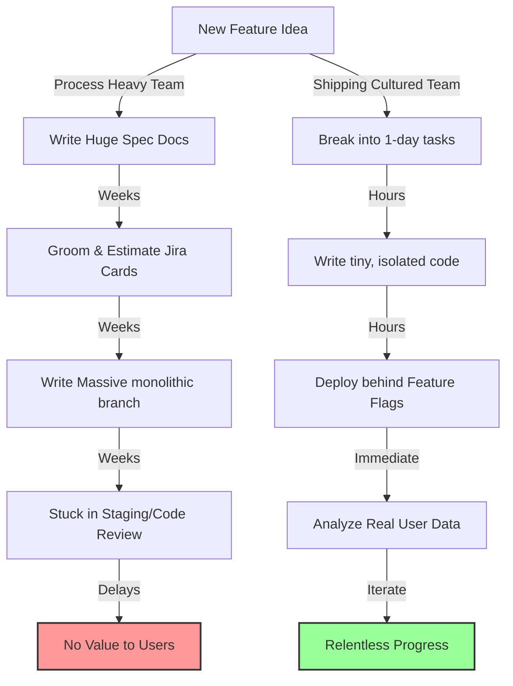

# Engineering Teams That Actually Ship

> **TL;DR:** Many startup engineering teams are incredibly busy but rarely ship anything of value. They fall victim to "sprint planning theater"—substituting heavy process (Jira grooming, estimation points, retrospective rituals) for actual product momentum. Building a team that ships requires simplifying processes, cultivating extreme ownership, keeping pull requests microscopic, and prioritizing production over planning.

If you’ve spent any time in tech, you’ve probably witnessed some version of this scene:

It’s 10:00 AM on a Monday. Seven engineers, a product manager, and a scrum master are sitting in a conference room (or a Zoom call). They are staring at a Jira board containing 45 cards. For the next two hours, they debate whether a bug is a "3-point" task or a "5-point" task. They discuss dependencies, write detailed sub-tasks, assign story points, and commit to a "sprint goal."

Everyone leaves the meeting exhausted but feeling highly productive. After all, they just did "Agile."

Two weeks later, the sprint ends. Half the cards are pushed to the next sprint. The feature that was supposed to launch is delayed because of a "blocker" in the staging environment. But don't worry—the team holds a retrospective, draws some sticky notes on a virtual whiteboard under "What went well" and "What could be improved," and does it all over again.

This is **Sprint Planning Theater**. It is the illusion of progress through process. 

It is how teams stay 100% busy while shipping absolutely nothing. Let’s talk about how to break this loop and build an engineering team that actually ships production-grade software to real users.

---

## The Sprint Planning Theater Problem

Why do smart engineering teams fall into the process trap?

Because **process is comfortable**. Process is predictable. Writing a technical specification, grooming a backlog, and debating estimations does not carry the risk of failure. It feels safe.

But shipping? Shipping is terrifying. When you ship code to production, it might break. Real users might hate the interface. Your database queries might fail under actual load. Shipping exposes your assumptions to the cold, harsh light of reality.

When a team is stuck, their natural instinct is almost always to add *more* process. If a release was delayed, they add an extra approval layer. If a bug slipped into production, they write a 10-page post-mortem and introduce a new QA sign-off phase. 

Before you know it, you have turned your lightweight startup team into a slow-moving, bureaucratic IT department where developers spend more time filling out forms than writing code. You cannot mandate shipping velocity through process. Process is a buffer; people and culture are the engine.

---

## What "Shipping Culture" Actually Looks Like

A team with a shipping culture is obsessed with one thing: **the distance between writing code and that code delivering value to a customer.** 

If code is sitting in a local branch, on GitHub waiting for a review, or spinning in a staging environment, its value is exactly $0.00. In fact, it is a liability. It is unreleased work-in-progress inventory that is actively decaying as the codebase around it changes.

Here is what a relentless shipping culture actually looks like in practice:

### 1. Microscopic Pull Requests
The single greatest predictor of engineering velocity is Pull Request (PR) size. 
A team that struggles to ship writes massive, monolithic PRs containing 1,500 lines of code across 32 files. These PRs sit on GitHub for days because no senior engineer wants to spend three hours reviewing them. When they finally do get merged, they inevitably break three unrelated features.

A shipping team breaks features down so that PRs are rarely larger than 150 lines of code. A developer should be merging 2 to 3 small PRs *every single day*. These are incredibly easy to review, carries zero cognitive overhead, and can be rolled back instantly if something goes wrong.

### 2. Feature Flags as a Way of Life
You cannot ship tiny PRs if you are waiting for a feature to be 100% complete before merging. This is where feature flags (like LaunchDarkly or a simple database config) come in. 

A shipping team merges incomplete features into `main` and deploys them to production daily, but hides them behind feature flags. This separates the act of **deploying code** from the act of **releasing a feature**. It allows you to test your code in the real production environment with real infrastructure, long before the marketing team does the official launch.

### 3. Continuous Integration That Takes Under 5 Minutes
If your CI/CD pipeline takes 45 minutes to run, your developers will group their changes into massive deployments to avoid the wait time. Your deployment pipeline must be fast, reliable, and completely automated. If a developer merges to `main`, that code should be live in production inside of 5 minutes without a single manual command.

### 4. Direct Accountability (No QA Hand-off)
If you have a dedicated QA team whose job is to catch bugs after developers write code, you have broken the feedback loop. Developers will write sloppy code, throw it over the wall to QA, and expect them to find the errors.

In a shipping team, **you build it, you run it, you test it, you monitor it**. The developer who writes the code is entirely responsible for its correctness in production. If a bug breaks production, the developer’s phone should ring, not the QA manager’s. This alignment of incentives does more for code quality than any process ever could.

---

## How to Diagnose a Team That's Stuck

If your team is working 60-hour weeks but the product seems to be standing still, look for these three diagnostic warning signs:

*   **The "90% Done" Syndrome**: Every engineer tells you their task is "90% done" but it remains in that state for days. This means the task is either too big, poorly understood, or blocked by a dependency they didn't anticipate.
*   **Staging Environment Drift**: Your staging environment contains 40 features that aren't in production. Staging has become a swamp. Nobody knows exactly what is working, what is broken, or what is ready to deploy.
*   **High PR Cycle Time**: The average time between a developer opening a PR and that PR being merged is more than 24 hours. Your engineers are spending their mornings waiting for reviews instead of building.

---

## Concrete Practices to Build Momentum Today

If you want to turn a slow-moving team into a shipping machine, do not announce a big restructuring or buy a new software tool. Start small by introducing these three rules next Monday:

1.  **Enforce a 200-line PR Limit**: Make it a rule that no PR can exceed 200 lines of code (excluding automated test configurations or lock files). If it’s bigger, reject it automatically and ask the developer to break it up.
2.  **Delete the Staging Environment**: Okay, maybe don't delete it immediately if you have complex enterprise requirements—but treat it as a temporary transition phase, not a permanent home. Strive to make production the only environment that matters, using robust error tracking (Sentry), monitoring, and feature flags.
3.  **Hold Daily 5-Minute Standups (Without Jira)**: Stop going through the Jira board line by line. Instead, ask each developer: *“What did you ship yesterday, and what are you shipping today?”* If they cannot answer with something concrete that moved closer to production, ask how you can help them unblock it.

---

## Key Takeaways

- **Process is a poor substitute for talent and culture**: Do not let sprint rituals mask a lack of ownership or product momentum.
- **Micro-PRs solve almost everything**: Tiny code changes are easier to write, easier to review, easier to test, and significantly safer to deploy.
- **Decouple deploy from release**: Leverage feature flags to merge code into `main` early and often, completely eliminating massive, high-risk "launch day" merges.
- **Ownership is the best quality control**: Ensure the engineer who writes the code is the one who monitors its success in production.

---

## Frequently Asked Questions

**Q: Doesn't shipping tiny PRs and deploying multiple times a day increase the risk of breaking production for our users?**  
A: Counter-intuitively, it dramatically *decreases* risk. When you deploy a monolithic branch containing three weeks of work, finding the root cause of an error is like looking for a needle in a haystack. But when you deploy a 50-line PR that only adds a single database index or a button, and the system errors spike, you know exactly what broke it. You can roll it back in seconds.

**Q: How do we handle complex database migrations when shipping incrementally?**  
A: Database migrations must be managed in a backward-compatible, multi-step process. First, deploy a migration that adds the new column/table without modifying existing code. Second, deploy code that writes to *both* the old and new columns. Third, backfill your historical data. Fourth, update your code to read exclusively from the new column. Finally, deploy a migration to safely drop the old column. It sounds tedious, but it is 100% safe and causes zero downtime.

**Q: Our product manager keeps changing requirements mid-sprint. How do we ship under those conditions?**  
A: This is why sprints are often too long. If your product requirements change that fast, stop doing two-week sprints. Move to a continuous Kanban style or run one-week cycles. More importantly, break your features down into such small milestones that even if requirements change, you haven’t wasted weeks of work on an uncompleted monolith.

---

*If this resonated, hit subscribe — I write about startup leadership, engineering culture, and building real products every week.*

*— [Shantanu Vishwanadha](https://substack.com/@thecoderpanda)*
