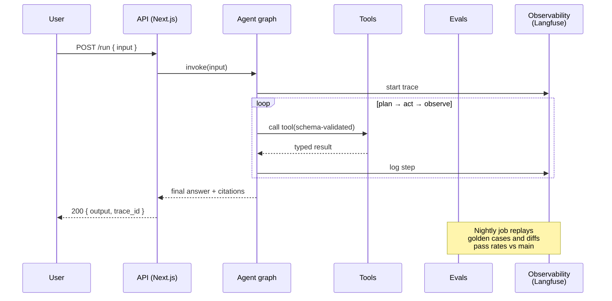

# The FDE Playbook I Kept Rebuilding — So I Open-Sourced It

> **TL;DR:** Every forward-deployed AI engagement I've taken on ended up rebuilding the same scaffolding — an eval harness, trace wiring, a Dockerfile, a CI gate, a set of "how do we do X here" runbooks. I finally packaged all of it as an open-source template: **[`fde-agent-starter`](https://github.com/thecoderpanda/fde-starter-kit)**. Vercel AI SDK chat UI, typed tools, evals gated in CI, Langfuse tracing, one-command Fly.io deploy, and a bundle of Agent Skills that encode the FDE workflow itself. MIT licensed.

## The pattern that finally embarrassed me into building this

Every forward-deployed AI engagement I've taken on in the last eighteen months has started the same way.

Day 1: kick-off call. The customer wants "an AI agent that can do X."
Day 2: I open a fresh repo, drop in a Next.js scaffold, wire the Vercel AI SDK, define two or three tools with Zod schemas, and get a chat window talking to GPT.
Day 3: it works well enough for a demo. The customer smiles. Someone on their side asks, "so how do we know it won't get worse tomorrow?"

That's the moment where every consulting deliverable stops being about the demo and starts being about the *system around the demo*. Evals. Traces. A deploy pipeline. Alerting. A way to add tools without regressing the ones you already have. A way to A/B two prompts without arguing about vibes.

I have rebuilt this exact scaffolding, from scratch, at least four times.

That is a smell. So I finally packaged it as an open-source template.

## What "forward-deployed" actually means in this context

A quick aside, because "FDE" has become the buzzword du jour and it means different things to different people.

The definition I use is the boring one: **you are the engineer who ships production software inside the customer's environment, against their real users, on their timeline, and you own the outcome — not just the code.** You are not writing a design doc for another team to implement. You are on-call when it breaks.

That framing changes what "done" looks like for an agent:

- **Done isn't "the demo works."** Done is "we can tell the moment the demo stops working."
- **Done isn't "the tool call succeeded."** Done is "we can replay the exact input that made it fail."
- **Done isn't "we deployed it."** Done is "we can roll back to yesterday's build in under a minute."

The starter kit is opinionated about all three.

## What's actually in the box

The full tree is [in the README](https://github.com/thecoderpanda/fde-starter-kit), but the pieces that make it a *system* instead of a chatbot demo are:

### 1. A chat UI you don't have to think about

Next.js App Router + Vercel AI SDK. `useChat` on the client, an edge-friendly `/api/chat` route on the server. The interesting code lives in `agent/graph.ts`, which is deliberately thin — the SDK handles streaming, tool calling, and message history so the graph file is where *your* logic lives, not framework plumbing.

### 2. Typed tools with Zod schemas

Every tool declares its input shape in Zod, and the schemas are the contract the model sees. Three example tools ship in the box (`web_search`, `sql_query`, `read_file`) and they exist as much to illustrate the pattern as to be useful. Adding a fourth is a five-line change plus an eval case.

### 3. An eval harness that actually gates CI

This is the part I care about most.

Golden cases live in `evals/cases/*.jsonl` — one JSON per line, one case per line. Each case has typed assertions: `contains`, `regex`, `tool_called`, `max_steps`, `not_contains`. The runner reads every `.jsonl` in the folder, invokes the agent for each case, and exits non-zero if any assertion fails.

The GitHub Actions workflow (`.github/workflows/eval.yml`) runs that suite on every PR that touches `agent/`, `evals/`, `app/api/`, or `package.json`. It also runs nightly at 04:00 UTC against `main` so model-drift regressions show up even without a code change.

The fast quality gate (typecheck + lint + unit tests) lives in a separate `ci.yml` workflow so forks and Dependabot can run it without needing an API key.

### 4. Langfuse tracing that no-ops silently

`agent/tracing.ts` is a thin wrapper. Missing keys = no-op, so a fresh clone runs without any observability setup. Keys present = every tool call and completion gets a span, with the exact input, output, and latency. `npm run langfuse:up` spins up the whole Langfuse stack locally in a single docker compose.

### 5. Deploy that is one command

Multi-stage Dockerfile, runs as non-root, produces a ~140 MB image on Node 20-alpine. A `fly.toml` with auto-stop, region pinning, and a `/api/health` check. If Fly.io isn't your target, the Dockerfile is the portable part — swap the toml for a Cloud Run YAML or a Render blueprint and everything else moves with you.

### 6. Multi-provider from day one

OpenAI, Anthropic, Gemini, DeepSeek, OpenRouter. The provider registry auto-detects from whichever API key is present, and model IDs are fully env-driven with a three-tier precedence:

1. `AGENT_MODEL` — a global override
2. `AGENT_MODEL_<PROVIDER>` — per-provider pin (e.g. `AGENT_MODEL_OPENAI=gpt-4o`)
3. Built-in fallback

Swapping models is a one-line env change instead of a code change. Which is exactly what you want when a client asks "can we try Claude here?" at 4pm on a Friday.

### 7. The `./skills/` bundle

This is the piece that makes the template different from every other agent starter on GitHub. Each folder under `./skills/` is a self-contained runbook that an AI coding agent (Claude Code, Zencoder, or any Anthropic Agent Skills–compatible runtime) can load to do one FDE task well:

| Skill | What it does |
|-------|--------------|
| `agent-eval` | Runs the suite on the current branch and diffs pass rates vs main |
| `prompt-diff` | A/Bs two prompts across the golden cases and shows which improved |
| `trace-debug` | Pulls a failing Langfuse trace and hypothesizes a root cause |
| `deploy-agent` | Ships to Fly.io behind six safety gates and smoke-tests the release |
| `add-tool` | Scaffolds a new tool with schema, registry entry, and eval case |

Skills are *portable across runtimes* — copy or symlink the folder into whatever agent you use. The `skills/README.md` walks through install for Claude Code, Zencoder, and a generic Anthropic-compatible runtime.

## How a request flows through the agent



Every arrow above is a place where things break in production — and every one has a corresponding skill in `.skills/` that knows how to debug it.

## Why this is a template repo, not a framework

There's a temptation, once you notice a pattern, to package it as a library. I resisted that on purpose.

Frameworks force you to inherit their opinions forever. Templates hand you a working starting point and get out of your way. If you outgrow the eval harness, you rip out `evals/run.ts` and drop in your own. If you swap Vercel AI SDK for Mastra or LangChain, you rewrite `agent/graph.ts` and everything else keeps working. Nothing in the repo imports from a fictional `@fde-agent-starter/core` package, because there isn't one.

That's the whole design philosophy: **be opinionated about the defaults, permissive about the escape hatches.**

## Who this is for

- **Consultants and forward-deployed engineers** shipping their fifth agent this quarter and tired of copy-pasting yesterday's `Dockerfile`.
- **Founders** who need to go from "we should build an agent" to "the agent is in prod" without hiring an infra team first.
- **Engineers evaluating agent stacks** who want a working reference they can read in an afternoon instead of a fifty-page architecture doc.

If you're building a chatbot for fun, this is overkill. If you're shipping something a customer will call you at 2am about, this is the least amount of scaffolding I've been able to get away with.

## Try it

```bash
git clone https://github.com/thecoderpanda/fde-starter-kit fde-agent
cd fde-agent
npm install
cp .env.example .env    # fill in one provider key
npm run dev             # http://localhost:3000
npm run eval            # run the golden set
```

That's it. Five commands to a working agent with evals, traces (if you set the Langfuse keys), and a deploy path.

**Repo:** [github.com/thecoderpanda/fde-starter-kit](https://github.com/thecoderpanda/fde-starter-kit)
**License:** MIT — clone it, fork it, ship it.

## What I want back from you

The roadmap should come from real deployments, not my imagination.

If you clone this and it saves you a weekend, ⭐ the repo so more people find it. If it *doesn't* save you a weekend, open an issue and tell me what's missing — that's the more useful signal.

I'm particularly interested in:

- Which skill would you write next?
- What's the first thing you rip out?
- Which provider is missing from the registry that you actually use in prod?

Drop it on the [GitHub Discussions tab](https://github.com/thecoderpanda/fde-starter-kit/discussions). I read everything.
