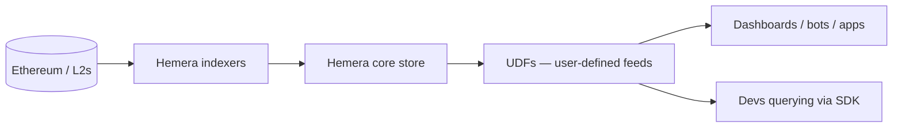

Blockchain has transformed the way we store and manage data. It offers unparalleled transparency, security, and decentralization. However, as the blockchain ecosystem continues to grow, with over 10 million transactions per day across various L1 and L2 networks. Developers are facing a new challenge: accessing and utilizing the data efficiently.

Retrieving meaningful information from blockchain can be a challenge for Dapp developers.

- Slow query times
- high costs and
- complex data structures

These are some of the challenges which in turn affect the development process. In fact, on Ethereum alone, querying complex data can cost up to $10 per query, making it financially unsustainable for developers running hundreds of queries daily.

This is where Hemera Protocol comes in. Built on two core technologies:

- **Account-Centric Indexing (ACI)**
- **User-Defined Functions (UDFs)**

Hemera Protocol is changing the way blockchain data accessibility is and empowers developers to build faster and more data-enriched dApps.

### The Limitations of Traditional Blockchain Indexing

To understand the significance of Hemera Protocol, let’s first examine the challenges developers face with traditional blockchain indexing methods.

In a conventional indexing system, data is organized by blocks. This means that if a developer needs information about a specific wallet or transaction, they must search through thousands or even millions of blocks to find what they’re looking for. This process is not only time-consuming but also resource-intensive, leading to slow query times and high costs.

Moreover, as the number of transactions on the blockchain grows exponentially, the problem of data accessibility becomes even more pronounced. With over 1.5 billion daily transactions across various networks, developers are left navigating a complex web of data, often spending more time writing queries and troubleshooting than actually building innovative products.

### Hemera Protocol: A Paradigm Shift in Blockchain Data Indexing

Hemera Protocol addresses these challenges head-on by introducing two groundbreaking technologies: Account-Centric Indexing (ACI) and User-Defined Functions (UDFs).

### Account-Centric Indexing (ACI)

ACI is a revolutionary approach to organizing blockchain data. Instead of indexing data by blocks, ACI organizes information around accounts. This is akin to having a library that arranges books by author and topic, rather than the date they were added to the collection.

With ACI, fetching account-specific data becomes incredibly fast and efficient. Developers can access the information they need in seconds, rather than hours or days. This is achieved by maintaining separate indexes for each account, allowing for quick lookups and reducing the need to scan through entire blocks.

Under the hood, ACI works by creating a separate index for each account on the blockchain. When a new transaction occurs, Hemera Protocol updates the relevant account indexes in real-time. This means that when a developer queries for data related to a specific account, Hemera can quickly retrieve the information from the corresponding index, without having to search through the entire blockchain.

&lt;a href="https://medium.com/media/648d93484c0463d91624e3cc9fa4aa0a/href"&gt;https://medium.com/media/648d93484c0463d91624e3cc9fa4aa0a/href&lt;/a&gt;

For more details on the technical implementation of ACI, refer to the [Hemera Protocol documentation on Account-Centric Indexing](https://docs.thehemera.com/welcome/account-centric-indexing-protocol)

### User-Defined Functions (UDFs)

UDFs are another game-changing feature of Hemera Protocol. They allow developers to create custom queries tailored to their specific needs, using a familiar programming language.

With UDFs, developers can write reusable, efficient queries that adapt to their requirements, saving time and reducing the complexity of their codebase. For example, a developer building a DeFi application can create a UDF to monitor liquidity pools and alert them when certain conditions are met. This level of customization and flexibility is simply not possible with traditional indexing methods.

Under the hood, UDFs are executed within the Hemera Protocol runtime environment. When a developer submits a UDF, Hemera compiles it into efficient, low-level code that can be run against the blockchain data. The results are then returned to the developer in their preferred format (e.g., JSON, CSV).

### The Impact of Hemera Protocol

The benefits of Hemera Protocol are far-reaching, impacting developers, businesses, and the entire blockchain ecosystem.

#### Lightning-Fast Queries

With Hemera Protocol, data queries are up to 10x faster than traditional methods. This means developers can fetch critical information, such as transaction histories and wallet balances, in mere seconds, saving hours or even days of development time.

#### Significant Cost Savings

By reducing operational costs by up to 30%, Hemera Protocol is a lifesaver for startups and enterprises alike. For example, a popular NFT marketplace was able to cut its data query costs by some thousands of dollars per month simply by switching to Hemera Protocol.

These cost savings can be attributed to several factors, including:

- Reduced infrastructure costs due to faster query times
- Elimination of redundant data storage
- More efficient use of computational resources

#### Empowered Developers

Hemera Protocol’s UDFs empower developers to create efficient, reusable queries that adapt to their needs. This means less time spent on complex data retrieval logic and more time focused on building innovative products.

### Real-World Applications of Hemera Protocol

Hemera Protocol is already making a significant impact across various sectors of the blockchain ecosystem. Here are a few examples of how it’s being used in the real world:

1. **DeFi Superpowers**: A leading DeFi protocol needed real-time liquidation tracking. With Hemera’s UDFs, they were able to monitor collateral levels and send alerts instantly, reducing query time from 30 minutes to just 5 seconds. This allowed them to prevent millions of dollars in potential losses due to liquidation events.
2. **Streamlined NFT Marketplaces**: NFT platforms are using Hemera to fetch metadata, transaction history, and pricing data on the fly, creating seamless user experiences. By providing fast and efficient access to NFT data, Hemera Protocol is helping to onboard more users into the world of digital collectibles.
3. **DAO Management Made Easy**: DAOs are leveraging Hemera to streamline governance by indexing proposals, votes, and results in real-time. This allows for more transparent and efficient decision-making processes, ultimately leading to better outcomes for DAO members.
4. **Powerful Analytics Dashboards**: From tracking whale wallets to visualizing token movements, Hemera makes building analytics dashboards simple, fast, and affordable. By providing easy access to granular blockchain data, Hemera Protocol is enabling a new wave of data-driven insights and decision-making.

### The Future of Blockchain Data Accessibility

As the Web3 ecosystem continues to grow, the need for efficient and accessible blockchain data will only become more pressing. By 2030, it’s estimated that over 100,000 active dApps will be running on blockchain networks, handling billions of daily transactions.

Without tools like Hemera Protocol, developers will find themselves overwhelmed by the sheer volume of data, leading to slower development cycles and increased costs.

### Join the Hemera Protocol Revolution

Whether you’re building the next big DeFi app, an NFT marketplace, or a DAO, Hemera Protocol is here to help you unlock the full potential of blockchain data. With its lightning-fast queries and significant cost savings, Hemera Protocol is transforming the way we interact with decentralized networks.

To get started with Hemera Protocol, visit the documentation: <https://docs.thehemera.com> and explore its features.

Join the UDF Builder Program: https://docs.thehemera.com/udf-builder-program to create your first custom data query and experience the power of Hemera firsthand.

Blockchain data accessibility doesn’t have to be a challenge anymore. With Hemera Protocol, it’s fast, affordable, and developer-friendly. Embrace the future of blockchain data and start building with Hemera Protocol today!

## Where Hemera sits in the stack

