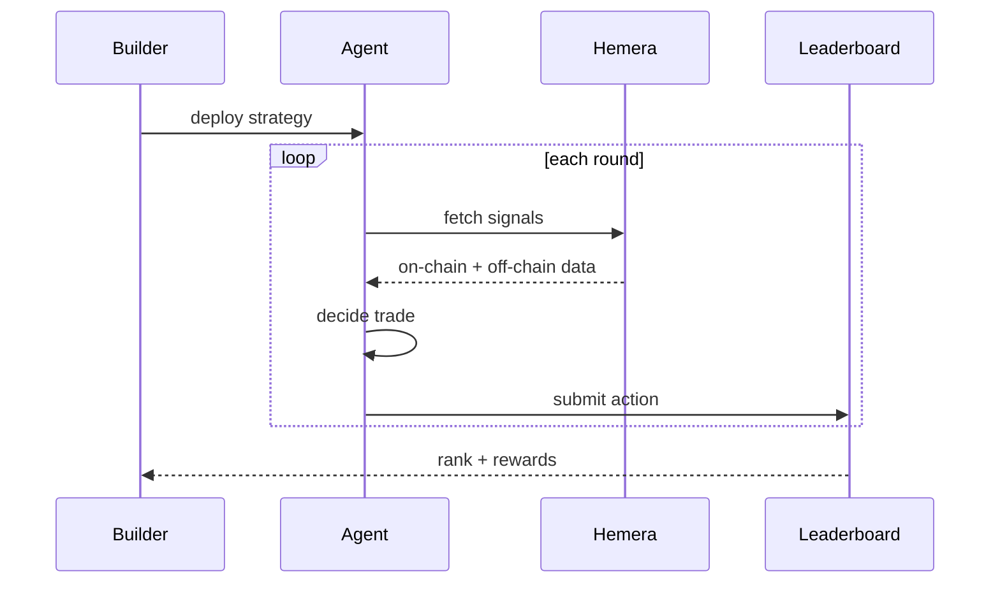

Trade smarter, win bigger — we’re thrilled to announce that Hunter Agent now supports real-time trading! To celebrate the launch, SocialScan is hosting a one-week Hunter Agent Trading Competition, top winner earns up to 30% of all trading fees generated from this competition. Trade on BASE chain and compete for big rewards!

#### Campaign Structure:

Campaign Period: **April 8th-15th**Campaign Reward: Top 10 traders with the highest PnL will share the cashback on all the trades!

#### How to Participate

1. **Get Started with Hunter Agent**
2. Visit [SocialScan](https://socialscan.io/meme-dashboard) and click the **「Hunter Agent」** button in the left menu, or go to [Hunter Agent bot](https://t.me/socialscan_meme_hunter_bot)

The following window will appear:

- Click to open SocialScan Hunter Agent on Telegram
- Click /start command to generate your EVM wallet address

**2. Deposit BaseETH to Your Wallet**

Go to My Portfolio to find your EVM wallet address. Purchase BaseETH from any exchange and transfer it to your SocialScan wallet (tap to copy the address)

1. **Complete Your First Trade**After depositing funds into your wallet, you’re all set to trade!

**Method 1: Trading from CA Search**

Buying:

- Go to My Portfolio, click **Buy**
- Enter the token’s contract address

- Once the token details load, select the ETH amount or tap **‘Buy X’** to enter the exact amount of ETH you want to spend

- Confirm your transaction to complete the trade

### Selling:

- You can view your MEME holdings in My Portfolio

- Select the MEME you want to sell and click Buy/Sell to trade

**Method 2: Instant Trading from Token Alerts**

When Hunter Agent sends you a Token Alert, simply tap the Buy button below the notification to execute an instant trade

## How the competition runs

