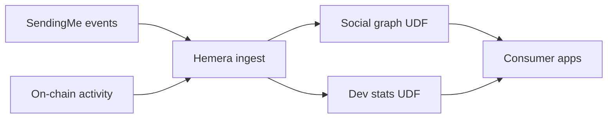

Imagine opening an app that gives you a crystal-clear view of your digital footprint: from NFTs you proudly own to the tokens fuelling your DeFi adventures, even metrics showcasing your developer journey.

SendingMe, a next-gen platform focused on community interactions and insights, has taken a massive leap by integrating Hemera’s User-Defined Functions (UDFs) to deliver these data-rich insights.

Let’s break down how Hemera UDFs are fuelling this integration, making complex on-chain data not just digestible but genuinely useful.

### The Why: Hemera Meets SendingMe

SendingMe wanted to supercharge its platform by giving users a snapshot of their on-chain activities, asset holdings, and developer credentials. But pulling all that data? It’s no small feat. The blockchain is an ocean of information, with raw data scattered across layers, contracts, and interactions. Without a robust system, surfacing actionable insights is like finding a needle in a haystack.

**Hemera Protocol** partnered with Sending Labs to facilitate this feature, specifically the UDFs which are tailored to wrangle blockchain data with precision and efficiency. By integrating Hemera, SendingMe can now fetch, process, and display user-centric data seamlessly.

### The What: Breaking Down the Data

Here’s what SendingMe’s integration with Hemera UDFs unlocks for its users:

#### User Assets:

- **Ethereum NFTs:** A quick inventory of NFTs owned, complete with a count.
- **Total Token Value:** The sum value of all Ethereum-based tokens held by the wallet.

#### On-Chain Activities:

- **Wallet Age:** Calculated as the duration from account creation to today, precise to one decimal point. This is fetched from Hemera’s parsing of blockchain events.
- **Total Gas Expenditure:** Tracks every wei spent on gas fees, aggregated into ETH.
- **Uniswap Metrics:** Covers trading volume and LP holdings, giving users insights into their DeFi movements.
- **Eigenlayer Restaking Values:** The total value of assets restaked via Eigenlayer — an essential stat for the staking community.

#### Developer Credentials:

- **Developer Tenure:** Measures years since the first Ethereum contract deployment.
- **Unique Active Wallets (UAW):** The total number of unique wallets interacting with a developer’s contracts.
- **Transactions:** Tracks total transactions across all contracts linked to the wallet.

### The How: Hemera’s Role in Data Integration

**Asset & Wallet Data:**

Hemera UDFs streamline the process of extracting fields like wallet age and gas expenditure by parsing blockchain logs and metadata. With the power of UDFs, SendingMe can ensure that users receive precise and up-to-date stats every time they access their dashboard.

**Uniswap and Eigenlayer Metrics:**

Hemera’s indexing capabilities simplify the extraction of complex metrics like trading volumes, liquidity positions, and staking values. By aggregating and formatting this data, SendingMe provides users with actionable insights that are easy to interpret.

**Developer Insights:**

For developer-related metrics, UDFs parse historical contract data to calculate metrics like developer tenure and transaction counts. By leveraging Hemera’s efficient data processing pipeline, SendingMe ensures scalability and accuracy even as the platform grows.

### The Impact: Data That Speaks to Users

By weaving Hemera UDFs into its backend, SendingMe turns raw blockchain data into human-readable, actionable insights. Whether you’re a DeFi enthusiast tracking your LP returns, an NFT collector showcasing your prized assets, or a developer measuring your on-chain influence, this integration brings clarity to the chaos of Web3 data.

It’s not just about numbers. It’s about empowering users to make informed decisions, celebrate their achievements, and explore the untapped potential of blockchain data.

Hemera UDFs not only empower users with insights into their own data but also foster confidence in the people they interact with. By revealing transparent on-chain metrics like wallet age, transaction history, and developer credentials, SendingMe ensures that users can verify the authenticity of profiles and build genuine connections.

This essentially reduces scams and eventually improving interactions. Knowing whether someone is an experienced DeFi trader, a verified developer, or a legitimate NFT collector helps users engage with true individuals, not faceless accounts.

### The Bigger Picture

The Hemera-SendingMe integration isn’t just a technical milestone; it’s a glimpse into the future of Web3 applications. By combining Hemera’s indexing prowess with SendingMe’s user-centric approach, this partnership sets a new standard for how blockchain data can be leveraged to enhance community platforms.

So, the next time you log in to SendingMe and marvel at the stats on your dashboard, you’ll know the magic behind the scenes: Hemera UDFs, bridging the gap between data and delight.

## SendingMe × Hemera, at a glance

