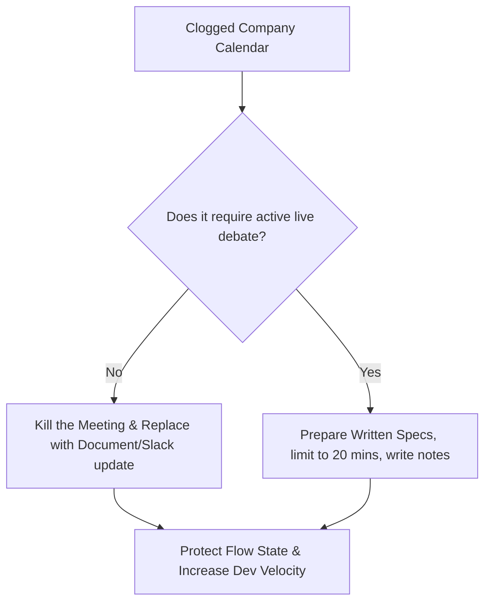

Well, we were all thrown into the deep end of the remote work pool this month, ready or not. 

If you’re a manager, founder, or tech lead, you’re probably in a mild state of panic right now. Your office is empty, your whiteboard has dried up, and you can no longer turn around in your chair to ask a developer how their sprint is going. 

In response to this loss of physical control, many managers have committed a classic, catastrophic mistake: **they tried to copy-paste the physical 9-to-5 office directly into Zoom and Slack.**

The result? Your developers are now spending six hours a day in exhausting video calls, nodding along to slides while their IDEs sit cold. When they aren't on Zoom, they are being pinged every three minutes on Slack by anxious teammates demanding immediate responses. It is a nightmare of constant distraction, Zoom fatigue, and zero actual output.

The physical office relies on synchronous presence—the assumption that work only happens when people are sitting in the same building at the same time. But a highly successful, distributed team operates on a completely different paradigm: **Asynchronous Work.**

Async means work doesn't happen in real-time. It means protecting your team's focus, writing down specs instead of jumping on calls, and trusting people to execute tasks independently.

Here is a practical, day-by-day playbook to tear down your synchronous meetings and build a highly productive, asynchronous remote engineering team in exactly 7 days.

---

### Day 1: Execute a Calendar Audit (Kill 80% of Meetings)

Look at your company calendar. It is likely clogged with status updates, syncs, alignment sessions, and quick touch-bases. 

Your mission on Day 1 is to **ruthlessly delete them**. 

- **The Daily Standup**: If you have a 30-minute meeting where 10 developers take turns reciting what they did yesterday, kill it. It is an expensive, low-efficiency way to share data. Replace it with a written update (we’ll set this up on Day 6).
- **The "Quick Sync"**: If a meeting's purpose is "to align on a feature," cancel it. Require the owner to write a 1-page proposal and share it via document comments instead.
- **The Golden Rule**: If a meeting does not require active, live debate or difficult decision-making, it should be an email, a document, or a Slack message. 

---

### Day 2: Define Your Communication Stack and Rules

An async team cannot function without clear communication boundaries. If everything is discussed in a chaotic mix of Slack DMs, email threads, and Google comments, critical information will get lost.

Establish a rigid **Three-Tier Communication Stack**:

1. **Tier 1: High-Latency / Static (Notion, Wiki, Google Docs)**: This is for static documentation, engineering specs, product requirements (PRDs), and company policies. If it is meant to last longer than a week, it belongs here.
2. **Tier 2: Medium-Latency / Structured (GitHub, GitLab, Linear, Jira)**: This is for project management, ticket tracking, and code reviews. Technical conversations about a specific bug or feature must happen directly inside the pull request or task ticket, NOT in Slack.
3. **Tier 3: Low-Latency / Dynamic (Slack, Discord, Teams)**: This is for casual banter, urgent alerts, and quick, ephemeral questions. 

---

### Day 3: Write the "Slack Hygiene" Manual

Slack is a fantastic tool, but without strict boundaries, it is a weapon of mass distraction. On Day 3, document and share these Slack rules with your team:

- **Ban the "Hello"**: Never send a message that just says "Hey" or "Got a second?" and waits for a reply. It forces the recipient to context-switch just to find out what you want. Always send the full context in a single message: *"Hey! When you have a moment, could you look at this API error in `./src/auth.ts`? Link: [URL]."*
- **Establish Response SLA**: Make it clear that Slack is **not** a real-time messaging protocol. Set the expectation that response times should be under 4 hours, not 4 minutes.
- **Silence Notifications**: Encourage developers to close Slack entirely or turn on "Do Not Disturb" during their core programming blocks. Flow state is sacred.

---

### Day 4: Implement Written RFCs (Request for Comments)

If you need to make a technical or product decision, do not jump on a brainstorm call. Implement an **RFC (Request for Comments) workflow**:

Before writing a line of code or building a layout:
1. The developer or product manager writes a simple proposal outlining: The problem, the proposed solution, alternative approaches, and risks.
2. They share the document link with the relevant team members.
3. The team is given 24 to 48 hours to read, ask questions, leave feedback, and debate directly in the comments.
4. The owner incorporates the feedback, makes the final decision, and archives the document as a source of truth.

This ensures everyone has a voice regardless of timezone, creates a permanent record of why decisions were made, and results in significantly more thoughtful engineering architecture.

---

### Day 5: Enforce No-Meeting Focus Blocks

Even on a highly async team, some meetings are necessary. To prevent these meetings from fragmenting your developers' days, establish **No-Meeting Focus Blocks**:

- Declare **Meeting-Free Afternoons** (e.g., no meetings allowed after 1:00 PM) or dedicated **No-Meeting Days** (e.g., Wednesday is a sacred building day).
- This ensures developers have large, uninterrupted blocks of 4+ hours of deep, focused time to write code, review PRs, or build designs. A developer interrupted every 45 minutes by a meeting will write exactly zero lines of high-quality code.

---

### Day 6: Build the Async Status Update

Since we killed the physical daily standup on Day 1, we replace it today with a highly efficient, written **Async Status Update**:

Every morning by 10:00 AM in their respective timezone, each team member posts a short update in a dedicated Slack channel (e.g., `#team-standup`):
- **Progress**: What did I actually accomplish yesterday? (Include PR links/commits)
- **Focus**: What is my single most important task today?
- **Blockers**: Is there anything stopping me from making progress? (Tag the person who can unblock you)

This takes 2 minutes to write, 1 minute for the manager to read, and keeps everyone perfectly aligned without wasting a single second of live meeting time.

---

### Day 7: Launch, Measure, and Iterate

Today, your async machine is fully operational. Gather feedback at the end of your first week:
- Ask your developers: *"Do you feel you have more focused time to write code? Are the Slack expectations clear? How is your screen fatigue?"*
- Refine the process based on their real-world experience. 

---

### The Remote Competitive Advantage

The companies that succeed in the 2020s will not be the ones that spent the most money on beautiful office spaces with ping-pong tables. They will be the ones that mastered the art of asynchronous collaboration, deep work, and high-trust autonomy.

By shifting your team from real-time presence to async execution, you aren't just surviving a temporary lockdown—you are building a highly resilient, globally scalable engineering engine that can hire the best talent anywhere in the world and execute with absolute precision.

Unplug the Zoom webcam, open up a shared doc, and let your team finally do what they do best: build. Good luck!
