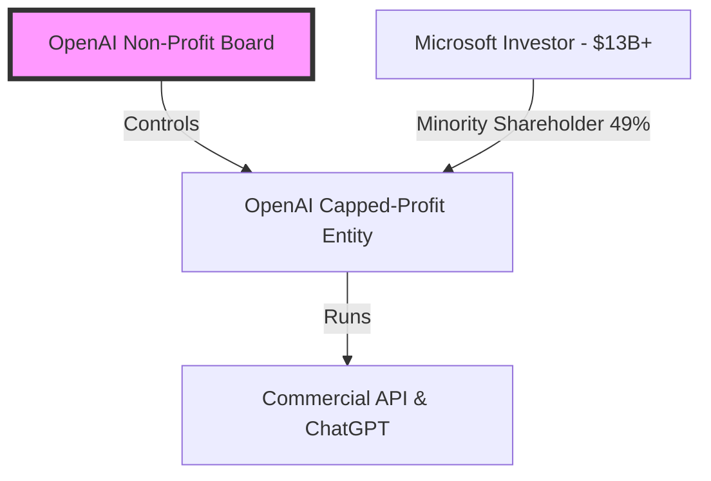

Grab your popcorn and buckle up, because the Silicon Valley soap opera just delivered its magnum opus. If you had "OpenAI boardroom coup, employee mutiny, and Microsoft takeover in under 120 hours" on your 2023 tech bingo card, congratulations—you are either a time traveler or a certified agent of chaos.

For those of us who spent the mid-November weekend glued to Twitter (X), frantically refreshing the feeds of tech reporters and OpenAI researchers, it felt like watching a high-stakes Shakespearean drama play out in real-time, complete with heart emoji-laden employee letters, late-night selfies at the OpenAI office with "guest" badges, and a trillion-dollar software giant acting as the ultimate puppeteer.

But now that the dust has settled, the board has been clean-swept, and Sam Altman is firmly back in the CEO chair, we need to talk about what this insane five-day roller coaster actually means. This wasn't just a corporate squabble; it was the first major battle in the war for the soul of artificial general intelligence (AGI).

Let’s deconstruct the madness.

---

## The Friday Coup: How to Lose a CEO in 10 Minutes

On Friday afternoon, November 17, while the rest of the world was winding down for the weekend, the OpenAI non-profit board of directors dropped a nuclear bomb. They announced that Sam Altman was out as CEO because he "was not consistently candid in his communications with the board." 

Almost immediately, Greg Brockman, OpenAI’s co-founder and president, was kicked off the board and resigned in solidarity. 

The internet went into absolute meltdown. Here was the golden boy of the AI revolution, the man who had just hosted OpenAI’s triumphal DevDay less than two weeks prior, suddenly exiled from his own kingdom. 

To understand why this happened, we have to look at OpenAI’s bizarre corporate architecture. It is a structure designed by people who wanted to save humanity but ended up creating a corporate ticking time bomb.

OpenAI started in 2015 as a pure non-profit research lab with a mission to build safe AGI that benefits all of humanity. But training LLMs is a remarkably expensive hobby. It turns out that to compete with Google, you don't need millions of dollars—you need billions of dollars and mountains of compute. 

To raise that cash, Sam Altman created a "capped-profit" subsidiary in 2019. Microsoft poured in over $13 billion. Crucially, however, the non-profit board retained absolute control. The board’s legal fiduciary duty was not to maximize shareholder value or return a profit to Microsoft; their duty was to ensure safe AGI. The board members didn't even own equity in OpenAI.

So, when the board’s safety-conscious faction, led by chief scientist Ilya Sutskever and independent directors Helen Toner, Tasha McCauley, and Adam D'Angelo, decided that Sam’s relentless commercial push was moving too fast and risking AI safety, they pulled the trigger. They exercised their legal authority to fire him.

---

## The Weekend Mutiny: "OpenAI is Nothing Without Its People"

The board had the legal right to fire Sam, but they completely forgot a fundamental rule of the knowledge economy: **the assets walk out the door every night.**

By Saturday morning, a massive counter-offensive was underway. Satya Nadella, the brilliant chess master running Microsoft, was furious. Microsoft’s stock had dipped, and they had $13 billion riding on this API. Satya didn't wait around. He immediately offered to hire Sam Altman, Greg Brockman, and any OpenAI employee who wanted to join them to head up a brand-new, advanced AI research team inside Microsoft.

Then came the leverage. 

On Monday morning, a letter began circulating within OpenAI. It was simple, elegant, and devastating. It stated that the board’s actions had jeopardized the company and demonstrated a complete lack of competence. The signatories demanded that the board resign and reinstate Sam Altman, or they would resign en masse and join Microsoft’s new division.

By Monday afternoon, over **700 out of OpenAI’s 770 employees** had signed the letter. 

Even Ilya Sutskever, who had helped orchestrate the firing, signed the letter and posted a public apology on Twitter: *"I deeply regret my participation in the board's actions. I never intended to harm OpenAI."*

Imagine being a board member and realizing that if you don't resign, your entire multi-billion-dollar company will literally cease to exist by Tuesday morning, leaving you with nothing but a brand name, an empty office in San Francisco, and a pile of legal liabilities. 

---

## The Imperial Victory: Sam’s Return and the New Board

By Tuesday night, the coup was dead. Sam Altman returned to OpenAI as CEO. The old board was dismantled. Helen Toner, Tasha McCauley, and Ilya Sutskever were out. In their place came heavy-hitting corporate veterans: Bret Taylor (former co-CEO of Salesforce) as Chair, and Larry Summers (former US Treasury Secretary). Only Adam D'Angelo remained to represent some continuity.

Microsoft got exactly what it wanted: a seat as a non-voting observer on the board, securing its massive investment and gaining unprecedented influence over the direction of the world's leading AI lab.

Sam Altman emerged from the crucible not just reinstated, but practically untouchable. The message was clear: OpenAI is Sam Altman, and Sam Altman is OpenAI.

---

## The Real War: e/acc vs. Effective Altruism

This five-day saga was the public-facing proxy war of a deep, philosophical schism that has been brewing in Silicon Valley for years. It is the clash between **Effective Altruism (EA)** and **Effective Accelerationism (e/acc)**.

| Attribute | Effective Altruism (EA) | Effective Accelerationism (e/acc) |
| :--- | :--- | :--- |
| **Primary Goal** | Minimize existential risk from AI | Maximize technological progress & energy deployment |
| **Philosophy** | AI could act as an existential threat; we must align it before scaling | Technology is a self-correcting system; faster growth solves problems |
| **Strategy** | Strict regulation, slower deployment, rigorous safety testing | Open-source release, market competition, rapid iteration |
| **Key Proponents** | Ilya Sutskever, Eliezer Yudkowsky, Dustin Moskovitz | Marc Andreessen, Garry Tan, Sam Altman (practically) |

The old board represented the EA faction. They feared that superintelligent AI could escape human control and destroy humanity. To them, slowing down and ensuring alignment was worth sacrificing market share.

Sam Altman represents the pragmatic accelerationist. He believes that the only way to build safe AI is to deploy it in the real world, let it interact with users, study its failures, and iteratively patch the safety guardrails. In his view, commercialization isn't just about making money—it is the engine that funds the safety research and provides the real-world feedback loops necessary for alignment.

With Sam's victory, the EA faction has lost its strongest institutional stronghold. The commercial accelerationists have won. OpenAI is no longer a safety-first academic research lab with a capped-profit side project; it is now, effectively, a high-octane enterprise software corporation backed by Microsoft.

---

## The Developer's Epiphany: Platform Risk is Very Real

For developers building the future on top of OpenAI’s APIs, those five days were a terrifying wake-up call. 

We’ve spent the last year wrapping `gpt-4` endpoints in elegant UIs, migrating our databases to support vector embeddings, and telling our stakeholders that AI is the core of our technical roadmap. Suddenly, over a single weekend, the API we rely on was threatened with literal extinction. 

If OpenAI had dissolved, hundreds of startups would have gone bankrupt by Tuesday afternoon. 

This crisis exposed the massive **platform risk** of the modern AI stack. We realized that we cannot treat LLMs like basic utilities like AWS S3 or Stripe. AWS doesn't collapse because of a boardroom dispute. OpenAI can.

The era of single-API dependence is officially over. Moving forward, robust engineering demands multi-LLM architecture, fallback pipelines, and a serious evaluation of self-hosted open-source models. 

OpenAI’s drama was a thrilling spectator sport, but for the engineering community, it was a fire drill. The builders who survive the next phase of the AI revolution are those who took the warning seriously and started diversifying their pipelines before the next Friday afternoon surprise.
