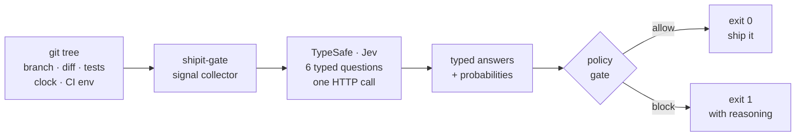

> **Series** — Part 1 of *Building with TypeSafe*. This one is a pilot: a small CLI to get a feel for the SDK. Follow-ups will get into scoring, cascades, and pattern composition.
>
> **Repo:** [github.com/thecoderpanda/shipit-gate](https://github.com/thecoderpanda/shipit-gate) &nbsp;·&nbsp; **npm:** [npmjs.com/package/shipit-gate](https://www.npmjs.com/package/shipit-gate)

I noticed **TypeSafe AI** and its flagship model **Jev** trending on X and spent a Saturday reading the docs. The programming model was interesting enough that I wanted to feel it in my hands rather than reason about it, so I built the smallest useful thing I could think of: a CLI that inspects a git tree and asks Jev whether it is a good idea to deploy right now.

The result is [`shipit-gate`](https://github.com/thecoderpanda/shipit-gate) — installable from [npm](https://www.npmjs.com/package/shipit-gate), MIT licensed, and deliberately tiny. Treat it as a pilot, not a product. What follows is a short tour of both the tool and the ideas behind it, aimed at anyone who has spent too much time wrapping `JSON.parse` in a `try/catch`.

---

## What TypeSafe and Jev actually are

Most LLM SDKs share the same shape: you write a prompt, ask politely for JSON, parse the response, and add defensive code around every field. The model generates text; your code tries to coerce that text back into a type.

TypeSafe's **System One** models invert that. Instead of generating text, they answer typed questions over a piece of state:

1. You provide **state** — the input the decision hinges on (a git diff, a ticket, a form).
2. You provide **typed questions** — small, named judgments with clear criteria.
3. You receive **typed answers with calibrated probabilities** — booleans, enums, or scores your code can use directly.

**Jev** is the flagship System One model. The three primitives you compose from are:

- **`noul`** — probability of a yes/no condition (`0`–`1`).
- **`choice`** — one option from a defined set, with a full probability distribution.
- **`score`** — a position on a described scale, with confidence.


The mental shift is small but real. You stop writing prompts and start defining decisions.

---

## The shape of the tool

`shipit-gate` collects deploy signals from the local environment, sends them to Jev as one request, and applies a small policy layer to the response.



The full loop is a single round-trip to Jev, typically under ~250ms. The tool asks six questions in parallel over the same state — `should_block`, `deploy_success`, `rollback_needed`, `blast_radius`, `reason_category`, and a human-readable one-line verdict.


The policy layer is intentionally boring: threshold checks on `deploy_confidence`, `rollback_risk`, and `blast_radius`. Raw judgments stay reusable; the policy is the part you tune per team.

---

## Example: a Friday afternoon deploy

Here is what the CLI looks like when it decides a change is not worth shipping right now — a migration touching billing, late on a Friday, on a dirty branch.


```
$ shipit check

→ collecting deploy signals...
→ asking jev...

────────────────────────────────────────────────────────────
  🛑 BLOCKED  — Jev has evaluated your deploy
────────────────────────────────────────────────────────────

  Verdict:  Migration + late hour — high rollback risk, wait for business hours.

  Signals
    time         Friday 17:42 America/Los_Angeles
    branch       feat/new-billing @ 4a9b21c (dirty)
    diff         37 files, +2140 -318
    risky areas  migrations, payments
    tests        pass

  Jev decision
    deploy_confidence  ████░░░░░░░░░░░░░░░░  0.21
    rollback_risk      ████████████████░░░░  0.82
    blast_radius       critical
    reason_category    timing

  Why blocked
    Jev's read: Migration + late hour — high rollback risk, wait for business hours.
    category: timing (day/hour makes this risky)   confidence: 0.87

    What Jev saw:
      • Friday 17:00 — late-week deploy window
      • Working tree dirty (4 uncommitted files)
      • Diff touches sensitive areas: migrations, payments
      • Large diff: 37 files, +2140 -318
      • Jev estimates 82% chance of needing a rollback within 24h
      • Blast radius = critical (auth/payments/data or core user flow)
```

The important detail is not that the tool refused — anyone can write `if (isFriday) block()`. It is that the decision, the confidence, and the human-readable summary all came from the same structured call, over the same state, in one round-trip.

---

## What the code actually looks like

The integration is a single request with six named questions. No prompt engineering, no output parsing.

```ts
const QUESTIONS = {
  should_block: {
    type: 'noul',
    instructions: 'Should this deploy be BLOCKED right now?',
    criteria: {
      true:  'Block: risk of an incident is meaningful, deploy should wait.',
      false: 'Allow: risk is acceptable, deploy should proceed.',
    },
  },
  blast_radius: {
    type: 'choice',
    instructions: 'If this deploy breaks, how much is affected?',
    criteria: {
      low:      'Isolated impact: internal tools, off-path code.',
      medium:   'One user-facing feature is degraded.',
      high:     'A core user flow is degraded.',
      critical: 'Auth, payments, data-loss, or a full outage.',
    },
  },
  // ...four more
};
```

The response is data, not text:

```json
{
  "answers": {
    "should_block": { "type": "noul", "noul": 0.87 },
    "blast_radius": {
      "type": "choice",
      "choice": "critical",
      "confidence": 0.79,
      "probabilities": { "low": 0.02, "medium": 0.07, "high": 0.12, "critical": 0.79 }
    }
  }
}
```

At the call site, this reduces to `if (decision.should_block) exit(1)`. A `noul` is a number; a `choice` is one of a known set. Neither can be malformed. The class of bug where the model returns `"yes"` on Tuesday and `true` on Wednesday simply does not exist here.

---

## Try it

The demo uses a mocked Jev response so you can see the three verdict states without an API key:

```bash
git clone https://github.com/thecoderpanda/shipit-gate.git
cd shipit-gate && npm install && npm run build
./demo/run.sh
```

For the real integration:

```bash
npm i -g shipit-gate
export TYPESAFE_API_KEY=sk_...
shipit check
```

- **npm:** [`shipit-gate`](https://www.npmjs.com/package/shipit-gate)
- **GitHub:** [`thecoderpanda/shipit-gate`](https://github.com/thecoderpanda/shipit-gate)
- **License:** MIT

---

## What I want to explore next

This is Part 1, and the tool itself is intentionally minimal. A few directions I want to try in follow-up posts:

- **`shipit history`** — record every gate decision and correlate `--force` overrides with real incidents. A calibration study against your own team.
- **Signal fusion** — mix in Sentry, Datadog, and PR review state as additional context; ask Jev the same questions with a richer view of the world.
- **Per-service policies** — different thresholds for the payments service than for the internal admin panel.
- **A Jev cookbook walk-through** — take one of the TypeSafe cookbook patterns (rerank, cascade, composite scoring) and build something small around it.

Contributions are welcome. Open an issue, add a signal, tighten a question, or challenge the thresholds.

---

## Takeaway from the pilot

Two things stood out after a weekend with Jev.

The first is that the interface actually holds. Every LLM integration I have built spent a non-trivial share of its lifetime on parsing errors, retries, and schema drift. That entire category is missing here, because the model does not return text.

The second is that decisions become composable. Six independent typed judgments over the same state, run in parallel, is a very different unit of work from one prompt that has to answer six questions in a fragile JSON envelope. Policy code, weights, and thresholds live in your codebase where they belong.

That is enough to keep building. **Part 2** will pick a different problem — a ranker or an extractor — and get further into `score` and confidence-driven behavior. If you want to follow along, the repo is [github.com/thecoderpanda/shipit-gate](https://github.com/thecoderpanda/shipit-gate) and the package is on [npm](https://www.npmjs.com/package/shipit-gate).

More soon.

— The Coder Panda
