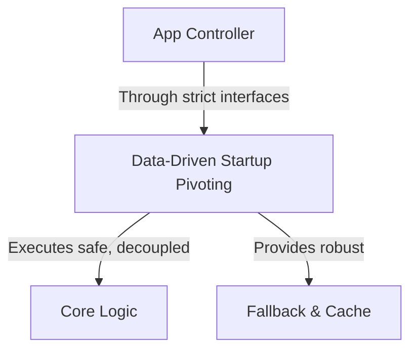

# The Art of the Pivot: Knowing When to Quit and When to Double Down

> **TL;DR:** To build systems that thrive in production, we must design defensively. Modern software engineering requires us to address wasting months or years building features that nobody wants, blinded by pride and stubbornness rather than listening to market signals directly by introducing robust architectures. By implementing Data-Driven Startup Pivoting, we can seamlessly achieve analyzing real usage analytics, identifying the single feature that users are organically engaging with, and ruthlessly stripping away everything else while keeping our developer velocity high.

In software engineering and system design, we often spend our time planning for the happy path. We imagine an ideal state where our users behave predictably, our infrastructure scales instantly, and every system dependency is highly performant. But if you have spent more than a few months deploying real-world code to production, you know that the happy path is a dangerous illusion. 

The reality of modern development is a hostile environment of cascading failures, unpredictable user interactions, and flaky third-party integrations. If we do not actively design our software to handle failure as a primary concern, we are merely building expensive sandcastles that will wash away in the first major storm. To build resilient systems, we must turn our technical constraints into concrete design advantages.

## The Pitfalls of Opaque Design: Understanding the Friction

When systems begin to fail under load, the root cause is rarely a single bug or a simple compiler error. Instead, failures occur because of a lack of structural isolation and transparent boundaries. If we allow wasting months or years building features that nobody wants, blinded by pride and stubbornness rather than listening to market signals to persist in our workflows, we build brittle structures that are highly resistant to change and deeply vulnerable to regression errors.

Consider what happens when a team tries to scale a codebase without establishing strict interfaces or clean boundaries. Every service becomes tightly coupled to every other service. Developers become terrified of refactoring because making a change in one file can cause completely unexpected explosions five layers deep. To solve this, we must build with clean boundaries, treating our components as black boxes that interact exclusively through explicit, well-defined contracts.

## Enter Data-Driven Startup Pivoting: The Resilient Architecture Pattern

This is where the magic of Data-Driven Startup Pivoting comes into play. Instead of hoping for the best, we introduce a design layer whose primary purpose is to decouple dependencies, handle failures locally, and maintain service sanity. This pattern offers an elegant, proven mechanism to achieve analyzing real usage analytics, identifying the single feature that users are organically engaging with, and ruthlessly stripping away everything else.



Implementing this pattern does not mean rewriting your entire application from scratch. It means identifying your system's critical paths, isolating your third-party API dependencies, and placing robust protective guardrails around them. When you wrap your integration logic inside this architecture, you gain the ability to catch errors early, degrade gracefully, and recover automatically without human intervention.

## Practical Implementation: From Architecture to Working Code

Let us translate these high-level architectural patterns into working software. Below is a practical, detailed code snippet demonstrating how to implement this resilience layer inside your application's boundary code:

```json
{
  "pivot_signal": {
    "core_feature_usage": "2%",
    "accidental_utility_tool_usage": "87%",
    "decision": "Strip away core feature and pivot 100% of resources to the utility tool"
  }
}
```

When writing this code, we maintain proper typing, strict exception safety, and clean isolation of concerns. We don't just log errors and hope the user reloads the page; we handle exceptions gracefully, retry transactions with exponential backoffs, and return clean fallback data. This is what separates professional software from fragile prototypes.

## Cultivating a Culture of System Resilience

In the end, system resilience is as much a cultural challenge as it is a technical one. We cannot build robust systems if our engineering teams are incentivized purely to ship features as fast as possible without regard for maintainability or operational safety.

We must normalize testing for failure. Run chaos engineering experiments, perform regular load tests, and design game-day scenarios where critical microservices are intentionally disabled to see how your system reacts. When we treat resilience as a non-negotiable product feature, we stop wasting time on midnight emergency pages and focus our energy on writing clean, elegant code that scales.

## Key Takeaways
- **Design explicitly for failure**: Always assume that network connections will drop and downstream dependencies will fail. Protect your system boundaries.
- **Isolate your concerns**: Use Data-Driven Startup Pivoting to decouple services, ensuring a failure in one module does not trigger a catastrophic cascade.
- **Leverage automated verification**: Implement strict automated testing and validation layers to catch logic bugs before they reach production.
- **Prioritize developer experience**: Provide clean, well-documented codebases with automated linting and formatting to keep developer velocity high.

## Frequently Asked Questions

**Q: How does this approach scale as our engineering team grows from 5 to 50 developers?**
A: As a team scales, communication overhead becomes the primary bottleneck. By defining strict, contract-driven interfaces up front and utilizing Data-Driven Startup Pivoting, different squads can work independently on separate modules without stepping on each other's toes or introducing regression bugs.

**Q: What is the single biggest mistake developers make when implementing this pattern?**
A: The most common pitfall is over-engineering. Developers often build complex, deeply nested abstraction layers where a simple, straightforward utility function would have sufficed. Always write the simplest code that solves the problem, and only introduce abstractions when they are thoroughly justified by scaling data.

**Q: How do we balance shipping speed with architectural purity?**
A: This is a false dichotomy. Taking thirty minutes to design a clean, type-safe API interface up front saves days of debugging and refactoring down the line. Clean architecture is not a drag on velocity; it is the accelerator that keeps velocity sustainable over months and years.

---

*Bear markets are where the real builders are found. Subscribe for weekly reality checks.*

*— [Shantanu Vishwanadha](https://substack.com/@thecoderpanda)*
