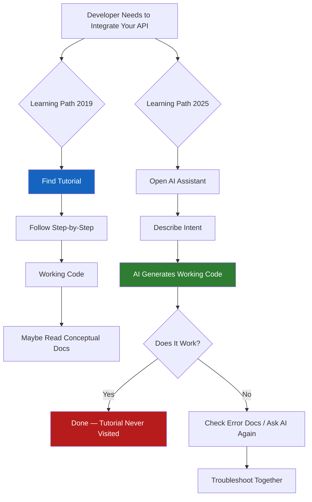

# The Death of the Tutorial (And What Comes Next)

> **TL;DR:** The traditional "step 1, step 2, step 3" tutorial was never really about teaching — it was about getting a developer to a working state as fast as possible. AI coding assistants now do that better and faster than any tutorial ever could. What they can't do is explain *why* a design decision was made, curate the 20% of knowledge that covers 80% of use cases, or give a developer the mental model that makes them effective beyond the immediate task. That's what DevRel needs to build now.

---

## How Developers Actually Learn in 2025

The learning loop has inverted. In 2019, when a developer encountered a new library or framework, the path was: find the tutorial, follow the steps, copy the code, get it running, then maybe read the conceptual docs if you felt like it. Most people never got to the conceptual docs.

In 2025, the path is: open the AI assistant, describe what you're trying to do, get working code immediately, then ask "why does this work?" if you care. The tutorial has been bypassed entirely.

This isn't speculative — watch any developer under 30 integrate a new API. They're not navigating to your documentation homepage. They're pasting the API reference into Claude or Cursor and asking for working code. The tutorial page gets visited if the AI-generated code doesn't work, which is less often than you'd think.

The data backs this up. Several developer tool companies I've spoken to have seen their tutorial page traffic drop 30-50% year-over-year while their API reference and error troubleshooting traffic has increased. The pattern is clear: developers use AI to get to working state, and they return to documentation when something goes wrong or when they need to understand something the AI got wrong.

What this means for DevRel is uncomfortable but important: **a significant portion of the tutorial content your team spent months producing is now less valuable than a single well-written prompt template that works reliably with GPT-4o or Claude.** That's not a reason to despair — it's a reason to figure out what content creates value that AI cannot replicate.

---

## What Tutorials Still Do That AI Can't

Before we bury the tutorial entirely, let's be precise about what AI actually cannot replace. Because the answer shapes exactly what to build instead.

**Curated learning paths.** AI has no sense of what you need to learn first. Ask an AI to teach you Kubernetes, and it will technically answer every question you ask — but it won't know that you should understand Pods before you try to understand Deployments, or that you need to understand Deployments before StatefulSets make sense. The tutorial's job was always curation — deciding what to show, what to hide, and in what order. That curation is now *more* valuable, not less, because developers who've gotten used to AI assistance are more likely to try to run before they can walk.

**Opinionated decisions in ambiguous spaces.** "How do I implement authentication?" is a question with 15 valid answers. JWT vs. sessions, OAuth vs. API keys, where to store tokens, how to handle refresh — an AI will explain all options neutrally. A good tutorial makes a decision and defends it: "We're going to use JWT with refresh token rotation because [specific reasons]. Here's exactly how to implement it." Developers are often drowning in options. The tutorial that makes a defensible decision and explains the reasoning is more valuable than the AI that presents all options with equal weight.

**The "why" behind design decisions.** This is the deepest gap. AI can tell you how to use a rate limiter. It cannot tell you why your specific API was designed to be rate-limited the way it is, what failure modes the rate limiting is protecting against, or what the intended usage pattern is that the design was built around. Product-level reasoning — the decisions that went into the product — is documentation that only your team can write.

**Building the right mental model for long-term effectiveness.** A developer who copies working code from an AI doesn't understand the abstraction. They have a thing that works. When they encounter a variant of the problem — a slightly different use case, an edge case, a failure mode — they're back to zero. The tutorial's deepest purpose was always to transfer the mental model that makes someone effective beyond the immediate example. That transfer cannot be delegated to AI.

---

## The New Formats That Work

If the step-by-step tutorial is losing relevance, what content formats create value for developers in 2025? Here's what I've seen work:

**Problem-first, not syntax-first content.** Traditional tutorials start with the tool: "Here's how to use our SDK. Step 1: Install the package." Problem-first content starts with the problem: "You need to stream LLM responses to a frontend without blocking. Here's why naive polling doesn't work, and here's the pattern that does." The developer has the problem before they encounter your content. Match the entry point.

**Interactive notebooks with real data.** Jupyter notebooks, Colab notebooks, Observable notebooks — the format where you can run code inline and see real output. This works because the learning feedback loop is immediate. You change a parameter, you see what changes. You break something, you see the error. This is closer to how AI-assisted learning works than a static tutorial, and it provides something AI can't: **a safe playground where mistakes are educational, not costly.**

**Video with precise timestamps and searchable transcripts.** The rise of YouTube as a developer resource is real, but most DevRel video is produced in a way that makes it hard to use. Nobody wants to watch a 45-minute setup tutorial when they need the answer to one specific question at minute 23. Video with chapter markers, searchable transcripts, and timestamps that are actually accurate for specific content — this is the format that works. It's more effort to produce, but a well-produced 12-minute video with proper chapter structure will outperform a 45-minute walkthrough every time.

**Decision guides.** Not "how to do X" but "when to use X vs. Y vs. Z, and how to decide." Developers hit decision paralysis all the time — SDK vs. raw API, which authentication pattern, which data format. A clean decision guide that explains the tradeoffs and makes a recommendation based on context is something AI does poorly (because it hedges) and that developers genuinely need.

**Troubleshooting guides organized by error message.** This is the highest-intent documentation that exists. A developer who has hit an error and is searching for that exact error message is at peak intent — they need help right now. Organized troubleshooting content that maps common errors to root causes and solutions gets searched, bookmarked, and shared in Slack. It's also indexed by AI training data, which means AI tools give better answers about your product when this content exists.

---

## What DevRel Teams Need to Build Instead

This is the practical part. If you're a DevRel team that has been producing traditional tutorial content and you're reading the signals — what do you actually build now?

**First: audit what you have.** Pull your analytics and separate content by type: tutorials (step-by-step setup), conceptual docs (how things work and why), API reference, troubleshooting guides, and decision guides. Look at traffic trends by type, not just absolute traffic. I'd bet you'll find that conceptual and troubleshooting content has held or grown while tutorial traffic has declined. That's your signal about where to invest.

**Second: invest in LLM-ready documentation.** This sounds like a technical detail but it's a strategic one. Large language models are trained on your documentation. They're also queried against your documentation by developers using AI assistants with RAG. If your documentation is vague, inconsistent, or incomplete in ways that humans can infer but models cannot — your product will get worse AI-assisted answers than competitors whose docs are precise. Write documentation as if it needs to be machine-understandable, not just human-readable. Define terms explicitly. Use consistent naming. Document edge cases and error states.

**Third: create the LLM prompts your users need.** This is the tutorial format for 2025. Instead of "Step 1: install the package," publish: "Here is the prompt that reliably generates working integration code for your use case." Test it. Maintain it as the models change. A curated, tested prompt template is genuinely more useful than a 12-step tutorial. It's also more honest about how your users are actually working.

**Fourth: focus on the opinionated content that AI cannot generate.** Architecture decision records. Design rationale documents. The specific "we chose this approach because" explanations that only your team knows. Comparison content that honestly explains when your product is and isn't the right choice. This content is unique to you, it's valuable to developers, and it cannot be replicated by AI.

**Fifth: build community as a learning infrastructure.** The deepest learning in developer communities happens peer-to-peer — in Discord, in GitHub Issues, in Slack communities, in forum threads. This is the learning format AI cannot replace because it's contextual, current, and human. DevRel teams that invest in community infrastructure — keeping discussions searchable and organized, surfacing common questions, creating channels where experienced users help newer ones — are building a learning resource that compounds over time.

---

## Key Takeaways

- **Tutorial traffic is declining because AI assistants now do what tutorials did** — get developers to working code faster than any step-by-step guide could
- **The content AI cannot replace is: opinionated decisions, mental model transfer, product-specific reasoning, and curated learning paths** — invest there
- **Problem-first content, interactive notebooks, and decision guides are the formats that work now** — not syntax-first step-by-step walkthroughs
- **LLM-ready documentation is a strategic advantage** — precise, well-structured docs mean better AI-assisted answers about your product, which means better developer experience even when developers never visit your site directly
- **Community is a learning infrastructure that compounds** — the peer-to-peer, contextual learning that happens in active communities is something AI fundamentally cannot replicate

---

## Frequently Asked Questions

**Q: Should we stop writing tutorials entirely?**

Not entirely, but deprioritize them relative to where you've historically invested. Getting-started tutorials that take someone from zero to working in under 10 minutes still matter — they're the first-run experience, and first impressions count. What doesn't compound the way it used to: the exhaustive 15-step tutorial that walks through every option and configuration. That's the content AI does better. Invest the time you'd spend on that in troubleshooting guides, decision docs, and conceptual explanation.

**Q: How do we measure success if tutorial traffic is declining?**

Shift your success metrics. Tutorial page views were a proxy metric — they were measuring "developers are using our docs to learn." The underlying outcome is "developers successfully integrate our product." Measure that directly: time-to-first-successful-API-call in your dashboard, activation rate from signup, support ticket volume for common integration issues. If those improve while tutorial traffic declines, you're winning. If they decline together, you have a different problem.

**Q: What's the right format for getting developers to understand *why* our API works the way it does?**

Short-form video with a clear narrative structure works well here. Not a tutorial — more like a "product walkthrough by someone who built it." 8-12 minutes, talking through the problem the product solves, the two or three key design decisions made and why, and the mental model that makes the product click. Ship it to YouTube, embed it in the docs, and treat it like a conversation rather than a lecture. Developers are highly receptive to "here's how the person who built this thinks about it" framing.

---

*If this resonated, subscribe — I write about developer education, DevRel strategy, and building for technical audiences weekly.*

*— [Shantanu Vishwanadha](https://substack.com/@thecoderpanda)*
