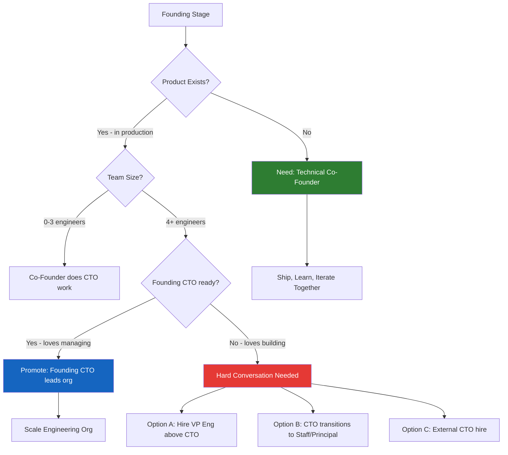

# The Founder-CTO Split: Lessons From the Trenches

> **TL;DR:** The most common startup failure mode isn't the product — it's the founding team dynamic. Specifically, the gap between the person who sells the vision and the person who builds it. I've watched dozens of startups navigate this. The ones that survived had clear roles, honest conversations about equity before things got emotional, and a shared definition of what "CTO" actually means beyond the title.

---

## Technical Co-Founder vs. CTO Hire: The Decision That Shapes Everything

Let's start with the question everyone gets wrong. Most non-technical founders think their first move is to "find a technical co-founder." Most technical founders think their job is to "find someone who can sell." Both framings are incomplete.

The real question is: **what stage of company are you actually building?**

If you're pre-product — no code exists, the idea is still fuzzy, you're figuring out whether the problem is real — you need a technical co-founder, not a CTO. A CTO is a management role. It's about building and leading an engineering org. At zero employees, there's no org to lead. What you need is someone who will sit in a Google Meet call with you at 11 PM, argue about data models, and push the first commit to production the next morning. That's a co-founder.

A CTO hire makes sense when you have something to manage. You have a product in production. You have 3-5 engineers. You have technical debt that's slowing you down. The technical decisions are no longer "what should we build" — they're "how do we scale what we built, hire the right engineers, and keep the system from falling over." That's a different skill set, and it often requires a different person.

The mistake I've seen repeatedly: founders hire a CTO when they need a co-founder (the CTO shows up to manage a team that doesn't exist and goes insane with boredom), or they make a co-founder a CTO without ever having the "what does this role actually mean" conversation (the technical founder suddenly has to run sprint planning when they'd rather be shipping).

---

## The Visionary CEO Who Can't Talk Tech: A Specific Failure Mode

I want to describe a person you've met. They have tremendous product instinct. They can read a room, close a deal, and articulate a 10-year vision that makes investors lean forward. They genuinely don't understand how software is built — not the basics, not the economics, not why "just add a feature" isn't a meaningful request. And they've decided this doesn't matter because they have a technical co-founder.

This works fine for about eight months. Then it starts to break.

The failure mode isn't that the CEO can't code. Nobody needs the CEO to code. The failure mode is that they **can't calibrate technical claims**. When an engineer says "this will take two months," they have no idea if that's sandbagging or genuinely accurate. When the CTO says "we have serious technical debt," they don't know if that means "we should refactor a module" or "this system will collapse in six months." They can't ask the right questions, so they either trust everything blindly or override on vibes.

The solution isn't to make the CEO learn to code. It's to get them technically literate enough to ask good questions. There's a specific list of things every non-technical founder needs to understand:

- **What is a deployment?** (What actually happens when code goes to production, and why it sometimes breaks things.)
- **What is an API?** (Not abstractly — concretely, so they understand why integrations take time.)
- **What is technical debt?** (The "we'll clean it up later" decision and its actual compounding cost.)
- **How does estimation work?** (Why two engineers can look at the same feature and give wildly different time estimates.)
- **What does "it's complex" actually mean?** (And why that's sometimes a cop-out and sometimes completely accurate.)

A non-technical founder who understands these concepts can have real conversations with their CTO. They can push back when necessary without overriding on vibes. They can tell the board what's actually happening technically without just relaying whatever the CTO said.

---

## What Makes a Great Founding CTO (It's Not Being the Best Engineer)

I've watched extremely talented engineers become terrible CTOs. And I've watched moderately skilled engineers become exceptional founding CTOs. The difference has almost nothing to do with technical ability above a certain baseline.

A great founding CTO has three things that the best engineers often lack:

**Tolerance for ambiguity.** The founding CTO is constantly operating without enough information. The product requirements will change three times this week. The business model might pivot. The hiring plan is based on funding that isn't closed yet. Brilliant engineers often want clear specifications before they build. Great founding CTOs can start building while the spec is still evolving, make reasonable bets, and not have a breakdown when the ground shifts.

**The ability to make decisions and move on.** At scale, you can run a proper technical RFC process, get consensus, document the decision, and ship six months later. At a startup, you need to pick the database in an afternoon. PostgreSQL or MongoDB? Monolith or microservices? REST or GraphQL? Wrong answers exist, but "no answer because we're still deliberating" is the most dangerous answer. Founding CTOs who are obsessed with making the optimal decision make the worst decision: no decision.

**Judgment about what to build vs. what to buy.** This is underrated. Every engineer's instinct is to build. Building is interesting. Buying is admitting you couldn't build it. But buying Stripe instead of building payments, buying Auth0 instead of building auth, buying Datadog instead of building observability — these decisions save months of engineering time that can go to building what actually differentiates your product. The founding CTO who reflexively builds everything is burning the company's runway on undifferentiated infrastructure.

The best founding CTO I've seen up close had one habit that explained a lot of their success: every week, they wrote a one-paragraph "technical state of the company" summary and shared it with the CEO. Not the full engineering update — just the thing the CEO needed to know to make good decisions. It forced the CTO to think clearly about what actually mattered, and it kept the CEO technically informed without requiring a 45-minute engineering all-hands.

---

## The Equity Conversation You Have to Have Before You Need To

Nothing causes more damage to a founding team than an equity split decided on wrong assumptions, discovered too late to change cleanly. So let's be direct about the conversations you need to have early.

**The "one person codes and one person sells" problem.** The most common early-stage split is 50/50, decided because two people like each other and don't want to have an awkward negotiation. This works fine until one person feels like they're doing more. And they will feel that, because in a startup, the person who is underwater always feels like they're doing more than the person who isn't. The solution isn't to negotiate a perfect split upfront — it's to have explicit agreement about what "equal contribution" means in your specific context.

**Vesting cliffs matter more than the percentage.** A 50/50 split with 4-year vesting and a 1-year cliff is dramatically better than a 60/40 split with no vesting. Vesting protects both parties. If the technical co-founder decides to leave at month 7 because the vision changed, the vesting cliff means they walk away with nothing — which is fair, because they weren't there for the hard part. If you have no cliff, you have a permanent shareholder who's no longer in the company.

**The "what happens when we raise a Series A" conversation.** Pre-seed, the CEO and CTO are equal. Post-Series A, the board is involved, the team is 20 people, and "co-founder" means something different. Does the technical co-founder want to be VP Engineering? CTO? Individual contributor? Does the CEO want to bring in a more experienced CTO? These are conversations that should happen before the term sheet, not after.

The specific question I recommend asking early: "If in three years, your role in this company has completely changed from what it is today — you're doing less of what you love and more of what the company needs — are you okay with that?" If both founders answer honestly and differently, you've found the landmine before it explodes.

---

## The Transition From Technical Founder to CTO With a Team

This is the part nobody warns you about. You've been the founding engineer. You know every line of code. You made every architecture decision. You can debug anything in the codebase in 20 minutes because you wrote it. Then you hire your first three engineers, then your next five, and then one day you realize you haven't committed code in three weeks and you have a skip-level 1:1 this afternoon.

The transition from "technical founder" to "CTO with a team" is genuinely hard, and it breaks people who aren't prepared for it.

**The code review trap.** Many founding CTOs stay involved by being the final reviewer on all PRs. This feels technical but becomes a bottleneck at scale. When your review is required for anything to ship, your calendar is the deployment queue. The right move is to transfer code ownership explicitly: document the architecture decisions, make sure at least one other engineer understands each system deeply, and set clear criteria for when you want to be involved versus when teams can move on their own.

**The "I can do it faster myself" syndrome.** True. You can. But the cost isn't the time saved on this task — it's the engineer who never develops ownership because you keep doing things for them. The founding CTO who does instead of delegates builds a team that can't function without them. That's not a technical asset; it's a bus factor problem.

**What the job actually becomes.** At 10 engineers, the CTO's job is roughly: set technical direction, run the hiring process, communicate the technical roadmap to the board, mentor senior engineers, and make the 5% of technical decisions that are genuinely hard and consequential. The other 95% of decisions should be delegated to engineers who are closer to the problem. The transition point is when you realize your most valuable contribution is no longer writing code — it's creating the conditions under which other people can write great code.

---

## Key Takeaways

- **The technical co-founder vs. CTO hire decision is a stage question**, not a skill question — you need a builder before a manager, always
- **Non-technical founders don't need to learn to code** — they need to learn to ask the right technical questions, and there's a short list of concepts that cover 80% of it
- **Great founding CTOs are defined by ambiguity tolerance and decision speed**, not raw technical skill above a certain baseline
- **Have the equity and vesting conversation before you have a term sheet** — vesting cliffs protect both parties and are more important than the split percentage
- **The hardest part of the CTO transition is letting go of code ownership**, and the ones who do it well have transferred knowledge and ownership explicitly, not by accident

---

## Frequently Asked Questions

**Q: Should a non-technical founder learn to code?**

Depends on the context. Learning the basics — enough to push a simple change, understand what a PR looks like, and not say things like "just make the button blue" — is genuinely useful. But spending six months learning to code instead of talking to customers is usually a mistake in priority. The goal isn't to be able to build the product yourself; it's to be technically literate enough to have real conversations with your CTO and not get snowed.

**Q: What's the best way to structure the CTO role when we're still figuring out the product?**

Keep it flat and explicit. The founding CTO's job in the pre-product stage is: build the thing, make the technical bets, tell the CEO what's actually hard and what isn't, and be honest when something will take twice as long as estimated. The title "CTO" is mostly ceremonial at this stage — what matters is that you've agreed on who makes technical calls and what happens when those calls conflict with what the CEO wants to prioritize.

**Q: How do you handle it when the founding CTO wants to stay a builder and the company needs a manager?**

Directly. This is one of the conversations that companies try to avoid and end up having badly, late, under pressure. The options are: bring in a VP of Engineering who manages the team while the CTO stays technical (works well when the CTO is genuinely a world-class engineer), have the CTO transition to a Staff or Principal engineer role (requires a lot of ego flexibility), or hire an external CTO and figure out what the founding engineer's role looks like going forward. All three can work. The one that definitely doesn't work is pretending the tension doesn't exist.

---

*If this resonated, subscribe — I write about building companies and engineering teams weekly.*

*— [Shantanu Vishwanadha](https://substack.com/@thecoderpanda)*
