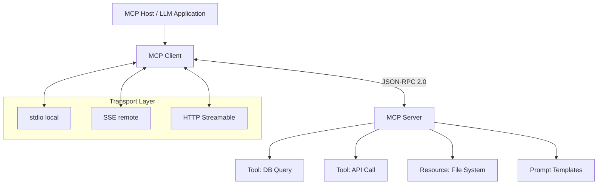

# The Model Context Protocol (MCP) Explained for Developers

> **TL;DR:** MCP is Anthropic's open protocol that standardizes how AI models connect to external tools, data sources, and APIs. Before MCP, every AI integration was a bespoke snowflake. After MCP, it's plug-and-play — write one server, connect to any compliant client. Here's how it actually works and how to build with it.

---

## The Problem MCP Solves (A Pre-MCP Horror Story)

Before MCP landed, building AI-powered tooling looked like this: you had a LangChain agent that needed to query your PostgreSQL database, call your internal API, search your codebase, and read from Notion. Each integration was a custom function, hardcoded into your chain, with its own authentication logic, its own error handling, its own schema definition. Change the model provider? Rewrite everything. Add a new tool? More bespoke glue code.

The situation was, charitably, chaos. The LLM ecosystem had roughly a dozen competing ways to define tools, with OpenAI's function calling format, Anthropic's tool use format, LangChain's `Tool` abstraction, and LlamaIndex doing its own thing. Teams were writing adapters for adapters.

Then Anthropic shipped the Model Context Protocol in late 2024, and something clicked. Not because it's technically revolutionary — it's a JSON-RPC protocol over stdio or SSE, which is about as glamorous as a POST request. It clicked because it's *open*, *simple enough to actually implement*, and *neutral enough that the industry adopted it fast*.

Think of it like USB-C for AI integrations. Before USB-C, every device had its own cable. USB-C didn't invent a new technology — it standardized one. MCP did the same thing for the AI tool layer.

---

## The Architecture: Clients, Servers, and Transports

MCP has three moving parts, and understanding all three is non-negotiable before you write a single line.



**The Host** is your LLM application — Claude Desktop, Cursor, your custom agent runtime, whatever. It contains the MCP client.

**The MCP Client** is the library-level code that speaks the MCP protocol. It discovers servers, negotiates capabilities, and routes tool calls and resource reads back and forth. You don't usually write the client yourself; you use an SDK.

**The MCP Server** is what *you* build. It's a small process — can be a Python script, a TypeScript binary, a Go service — that exposes three types of primitives:

- **Tools**: Functions the LLM can call (e.g., `run_sql_query`, `get_github_pr`)
- **Resources**: Data the LLM can read (e.g., file contents, database rows, API responses)
- **Prompts**: Reusable prompt templates for consistent behavior

**The Transport** is how client and server communicate. For local tools, it's `stdio` — the server runs as a subprocess and communicates over stdin/stdout. For remote servers (a shared database tool your whole team uses), it's Server-Sent Events (SSE) or the newer HTTP Streamable transport. The protocol is JSON-RPC 2.0 throughout.

The lifecycle is clean: the client sends `initialize`, gets back a capabilities manifest, and from then on can call `tools/list`, `resources/list`, `prompts/list`, and then actually invoke things via `tools/call` and `resources/read`.

---

## Building Your First MCP Server

Let's build a real one. A server that exposes your PostgreSQL database to any MCP-compliant client. This is the use case that actually sells engineers on MCP the first time they see it.

Start with the Python SDK:

```bash
pip install mcp psycopg2-binary
```

```python
import asyncio
import psycopg2
from mcp.server import Server
from mcp.server.stdio import stdio_server
from mcp.types import Tool, TextContent

app = Server("postgres-mcp")

DB_CONFIG = {
    "host": "localhost",
    "database": "mydb",
    "user": "postgres",
    "password": "secret"
}

@app.list_tools()
async def list_tools():
    return [
        Tool(
            name="run_query",
            description="Execute a read-only SQL query against the database",
            inputSchema={
                "type": "object",
                "properties": {
                    "sql": {
                        "type": "string",
                        "description": "SQL SELECT statement to execute"
                    }
                },
                "required": ["sql"]
            }
        )
    ]

@app.call_tool()
async def call_tool(name: str, arguments: dict):
    if name == "run_query":
        sql = arguments["sql"]
        if not sql.strip().upper().startswith("SELECT"):
            return [TextContent(type="text", text="Error: only SELECT queries are permitted")]
        
        conn = psycopg2.connect(**DB_CONFIG)
        cursor = conn.cursor()
        cursor.execute(sql)
        rows = cursor.fetchall()
        columns = [desc[0] for desc in cursor.description]
        conn.close()
        
        result = [dict(zip(columns, row)) for row in rows]
        return [TextContent(type="text", text=str(result))]

async def main():
    async with stdio_server() as (read_stream, write_stream):
        await app.run(read_stream, write_stream, app.create_initialization_options())

if __name__ == "__main__":
    asyncio.run(main())
```

Wire it up in Claude Desktop's config (`claude_desktop_config.json`):

```json
{
  "mcpServers": {
    "postgres": {
      "command": "python",
      "args": ["/path/to/your/postgres_server.py"]
    }
  }
}
```

Restart Claude Desktop. Now you can ask "What are the top 10 orders by revenue this month?" and Claude will call your `run_query` tool, execute the SQL, and return a real answer. No API wrapper. No middleware. Just the protocol.

The TypeScript SDK works the same way and is arguably better-maintained for production use cases. The pattern is identical — you define tools, handle calls, return content.

---

## The Ecosystem That's Emerged

By mid-2025, MCP has a legitimately impressive ecosystem. Here's what's actually worth knowing:

**Official servers from major players**: Anthropic ships reference servers for filesystem access, GitHub, Google Drive, Slack, PostgreSQL, and SQLite. These are production-quality starting points, not toys.

**Community servers**: There are now hundreds of community-built MCP servers — for AWS, Kubernetes, Linear, Notion, Stripe, Figma, Sentry, and more. The [mcp.so](https://mcp.so) registry is where you find them.

**Client support**: Claude Desktop was first. Cursor picked it up fast. Continue.dev, Cline, Zed, and a growing list of VS Code extensions now support MCP natively. The bet is paying off — once you have client support in the IDE, developers never go back.

**Frameworks**: LangChain and LlamaIndex both have MCP adapters now. If you're running a custom agent, you can drop in an MCP client library and immediately get access to the entire MCP server ecosystem.

The key insight is that MCP flipped the integration burden. Before, every AI client had to implement every integration. Now, you write the server once and every MCP client gets it for free. That's a genuinely different trade.

---

## Real-World Use Cases Worth Stealing

**Codebase-aware agents**: Ship an MCP server that exposes your code search, PR history, and CI status. Now any MCP client — Claude Desktop, Cursor, your custom agent — can answer "why is this test flaking?" with actual context from your repo, not hallucinations.

**Database Q&A without a BI tool**: The postgres server above is genuinely useful for non-technical stakeholders. Pair it with a Claude interface and your operations team can answer their own data questions without going through a data analyst.

**Internal API gateway**: Build one MCP server that wraps all your internal microservices. Your AI agents get a single, consistent interface to your entire stack, and you centralize auth in one place.

**Vendor integrations for AI agents**: If you're building a developer tool that uses AI, shipping an MCP server means Claude Desktop users can connect to your product instantly. It's a distribution play as much as a technical one.

---

## Where MCP Is Going

The protocol is still maturing. The rough edges are real: auth is not yet standardized at the protocol level (you're doing bearer tokens or environment variables today), discoverability for remote servers is still ad hoc, and the SSE transport has some reliability quirks in high-throughput scenarios.

What's coming that matters: OAuth 2.0 integration is on the roadmap, which will make remote MCP servers safe enough for enterprise use. A proper server registry with versioning will make discovery less "check the awesome-mcp GitHub list." And sampling — letting servers request completions from the LLM themselves — will unlock a whole class of agentic server behaviors.

The bet here is simple: MCP wins if the client ecosystem keeps growing. VSCode has 40 million users. If the official Python and TypeScript extensions ship native MCP support, the network effects compound fast. That's the trajectory it's on.

---

## Key Takeaways

- **MCP is a standardization story**, not a new technology. JSON-RPC 2.0 over stdio or SSE — the protocol is boring on purpose.
- **Three primitives**: Tools (functions LLMs call), Resources (data LLMs read), Prompts (reusable templates). Master these three and you can build anything.
- **Write one server, reach every client** — that's the value prop. The integration burden flips from the client side to a one-time server implementation.
- **The ecosystem is real**: GitHub, Slack, Postgres, filesystem access, and hundreds of community servers exist today and work with Claude Desktop, Cursor, and others out of the box.
- **Auth and discoverability are the current weak links** — plan for this in production, and watch the OAuth integration roadmap closely.

---

## Frequently Asked Questions

**Q: Do I need Anthropic's Claude to use MCP?**

No. MCP is an open protocol. Any LLM client can implement it, and several already have — Cursor, Continue.dev, Zed. Anthropic published the spec but doesn't own the ecosystem. You can build MCP clients and servers with any model backend.

**Q: How does MCP compare to LangChain's tool system?**

LangChain tools are library-level abstractions tightly coupled to LangChain's agent runtime. MCP tools are protocol-level — they're language-agnostic, runtime-agnostic, and work across any compliant client. The tradeoff is that LangChain tools are easier to start with inside a LangChain project; MCP tools are better when you want your tooling to be available across multiple AI applications.

**Q: Is MCP production-ready?**

The core protocol is stable and Anthropic has committed to backward compatibility. The official SDK for Python and TypeScript are solid. Remote transports (SSE/HTTP) have rough edges in high-load scenarios. For local stdio servers powering internal tooling, it's production-ready today. For multi-tenant remote servers, you'll need to add auth and monitoring yourself until the protocol matures.

---

*If this resonated, subscribe — I write about AI engineering and developer tools weekly.*

*— [Shantanu Vishwanadha](https://substack.com/@thecoderpanda)*
