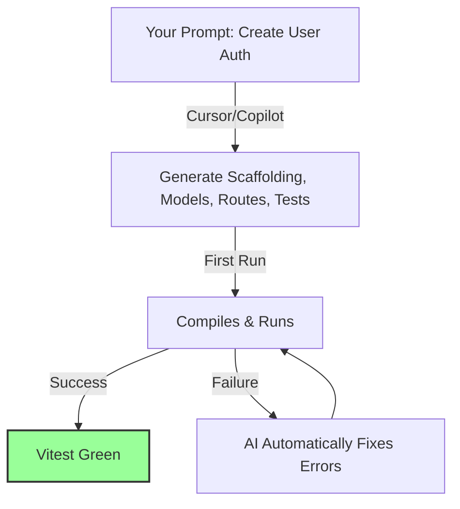

# Six Months of Vibe Coding: What I Actually Learned

> **TL;DR:** "Vibe coding"—programming by giving high-level natural language directions to AI agents while they generate the code—is a highly real, powerful shift in software engineering in late 2024. But it is not a silver bullet. While AI is incredible at boilerplate, unit tests, and rapid prototyping, it struggles deeply with architectural design, state synchronization, and complex debugging. The modern developer's job is shifting from **writing code** to **reading and editing code**, making system architecture, critical review, and rigorous testing the most valuable engineering skills in existence.

In early 2024, a new term took over the developer community: **Vibe Coding**.

Coined with a mix of irony and excitement, vibe coding describes a new way of building software. You don’t sit down and write code line-by-line, worrying about semicolons, import paths, or matching brackets. Instead, you open an AI-first editor (like Cursor or VS Code with Github Copilot Workspace), write some high-level English instructions about what you want to achieve, hit enter, and watch the editor write hundreds of lines of code across five files.

Your role changes from being a typist to being a director. You aren't writing code; you're setting a *vibe*, and the AI is doing the heavy lifting.

It sounds like a dream. But is it actually viable for building production-grade software? Or are we just generating mountains of unmaintainable technical debt at 100 miles per hour? 

I have spent the last six months fully embracing the vibe coding lifestyle. I have used AI assistants to build core application backends, scaffold complex frontend interfaces, write test suites, and refactor legacy databases. 

Here is the honest, unvarnished truth about vibe coding in late 2024: what got dramatically better, what is still incredibly painful, and whether this shift is making us better or worse developers.

---

## What Got Dramatically Better: The Zero-Boilerplate Utopia

Let's start with the good stuff. There are areas where vibe coding feels like absolute sorcery. If you aren't using AI for these tasks, you are actively wasting your time:

### 1. The Death of Boilerplate
Setting up a new microservice, configuring a Docker container, writing SQL schemas, or creating CRUD API routes used to require an hour of copying, pasting, and modifying legacy templates. Now, I can highlight a database schema file and prompt: *"Create five typed Express API routes with validation, error handling, and unit tests using this schema."* 

Boom. Done in 10 seconds. And the code is often cleaner and more consistent than if I had typed it out myself while tired.

### 2. Instant Unit Test Coverage
Nobody actually likes writing unit tests. It is a tedious, repetitive exercise in mock data setup and boundary checking. 

With vibe coding, writing tests is a breeze. I select a core business logic function, press `Cmd+K` in Cursor, and type: *"Write 12 comprehensive unit tests using Vitest, covering all happy paths and edge cases like null inputs, empty strings, and network exceptions."* 

It writes the mock data, handles the exceptions, and sets up the assertions. It turns writing test suites from a half-day chore into a 15-second background task.

### 3. Explaining and Refactoring Legacy Spaghetticode
If you inherit an ancient, undocumented, 500-line JavaScript function containing nested loops and zero comments, vibe coding is your best friend. You can ask: *"Explain what this function does step-by-step, identify three potential memory leaks or performance bottlenecks, and rewrite it in clean, typed TypeScript."* 

It acts like a highly patient, incredibly fast senior mentor who has memorized every programming manual in history.

---

## Where the Vibes Crash into Reality: The Hard Truths

If vibe coding was perfect, we’d all be technical founders of billion-dollar companies. But after three months, the initial honeymoon phase ends, and you run face-first into the structural limitations of AI-generated code.

### 1. The Architectural Drift (The House of Cards)
AI coding assistants are highly localized. They generate excellent code *for the specific file or block you are currently looking at*. But they lack systemic, global context. 

If you let an AI write features independently over several weeks, you will notice your architecture begins to degrade. It will introduce redundant state managers, import modules in circular patterns, bypass security middleware because it didn’t see it in the active file context, and build inconsistent API contracts. 

Left unchecked, your codebase becomes a giant, fragile house of cards. A change in one file causes completely unexpected, cascading failures five layers deep because the AI didn't understand the holistic system dependencies.

### 2. The Halting Problem of Debugging Async Logic
AI is terrible at debugging complex, stateful asynchronous bugs. 

If your application has a subtle race-condition inside a WebSocket connection-pooling manager, or if a database transaction is deadlock-locking under concurrent load, asking the AI to "fix it" will almost always result in a loop of despair. It will suggest a fix, which introduces a new bug, which you ask it to fix, which leads back to the original bug. 

To solve these deep technical issues, you still need a human engineer who understands CPU cycles, network latency, database locking models, and async event loops.

### 3. The Cognitive Lazy Trap
The biggest danger of vibe coding is **cognitive laziness**. 

Because writing code is so fast, you stop thinking deeply about what you are building. You accept the AI's generated code without reading it thoroughly. If the compiler doesn't throw an error, you merge it and move on. 

But when that code inevitably breaks in production under actual load, you have no idea how to fix it because *you didn't actually write it*. You have sacrificed your own deep understanding of your codebase for temporary velocity.

---

## The New Developer Skillset: From Typist to Auditor

If you want to survive as a developer in the era of vibe coding, you must evolve your skillset. The traditional developer who wins on "raw typing speed and syntax memorization" is becoming obsolete. 

The developers who are thriving in late 2024 are those who excel at **system-level auditing**:

*   **Deep Reading Comprehension**: You must be able to read and critique code faster than you can write it. You must look at the AI's output and immediately identify: *"Ah, this is using an `O(N^2)` loop here when it could use a hash map,"* or *"This database query is going to cause an N+1 query problem."*
*   **Systemic Architecture Design**: You must define the strict boundaries, schemas, and API interfaces *before* you let the AI write any code. Treat the AI like an army of junior developers—they need clear, explicit architectural guidelines and scaffolding to do high-quality work.
*   **Rigorous Verification and Evals**: Since you are generating code at an unprecedented rate, you must build robust automated test suites and validation pipelines to catch the AI's hallucinations before they hit production.

---

## Key Takeaways

- **Vibe coding is real, but demands guardrails**: Do not let the AI drive without a strict human-defined architectural map and API boundaries.
- **Never merge code you do not understand**: Read every generated line. Treat AI-written code with the same skepticism you would reserve for a random pull request from an unknown developer on GitHub.
- **Master the art of the context limit**: Feed the AI only the specific files, schemas, and types relevant to the task. Too much context leads to noisy, sloppy, and generic outputs.
- **Double down on system design**: The value of engineering has shifted from *syntax translation* (writing code) to *systemic orchestration* (designing architecture).

---

## Frequently Asked Questions

**Q: Is vibe coding going to make junior developers obsolete because they won't learn the basics of coding?**  
A: This is a major concern. If junior developers use AI to bypass the hard, frustrating phase of debugging syntax errors and reading stack traces, they may struggle to build the deep mental models required to solve complex, novel engineering problems. To prevent this, engineering leaders must encourage juniors to use AI as a *tutor* (asking "explain how this works") rather than an *automated typewriter* (asking "write this for me").

**Q: What is the best prompting strategy for vibe coding in Cursor?**  
A: Use the "Specification-First" prompting pattern. Do not just ask the editor to write code. First, ask it to output a markdown specification of the proposed changes, including API schemas, file changes, and testing strategies. Review and edit that specification. Once you are 100% happy with the design document, ask the AI to implement that *exact specification* file-by-file. This guarantees systemic alignment and prevents architectural drift.

**Q: Are we going to see a wave of massive, unmaintainable legacy AI codebases in the next few years?**  
A: Yes, absolutely. Companies that are rushing to ship features by letting non-technical managers or sloppy developers vibe-code without automated tests, linting, and architectural oversight are building massive tech-debt bombs. These codebases will eventually become so tangled and fragile that they will have to be completely scrapped and rewritten from scratch. Maintaining architectural purity is more important now than it has ever been.

---

*If this resonated, hit subscribe — I write about software engineering, AI assistants, and developer productivity every week.*

*— [Shantanu Vishwanadha](https://substack.com/@thecoderpanda)*
