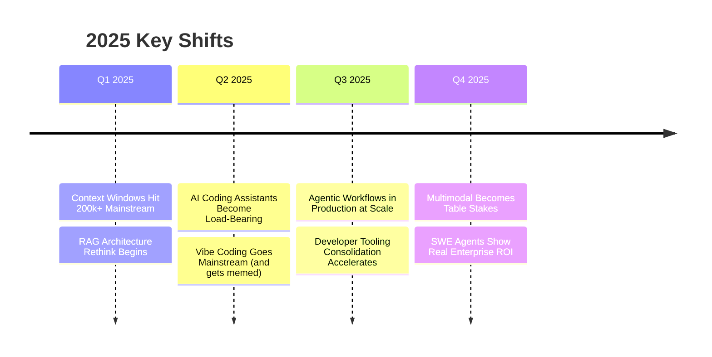

# 2025 Year in Review: What Actually Mattered

> **TL;DR:** I'm writing this in November because by the time you read a December year-in-review, you're already being told what to think about 2026. This is my honest accounting of what actually shifted in 2025 — not the narrative the AI companies want you to accept, not the backlash narrative either. What changed, what didn't, where I was wrong, and what I'm betting on heading into 2026.

---

## The Shifts That Were Real

Let me start with what I think most people are underestimating because it didn't come with a dramatic press release.

**Context windows crossed a threshold that changed software architecture.** When Claude and GPT-4 had 8k-32k context windows, the constraint was constant. You had to chunk, summarize, embed, retrieve — the entire RAG ecosystem existed because context was scarce. 2025 changed this in ways that aren't fully priced in yet. 200k-token context windows, the move toward 1M+ context in frontier models, the performance improvement in long-context reasoning — these aren't incremental upgrades. They're architecture changes. A meaningful portion of the RAG pipelines that were state of the art in 2024 are engineering overhead in 2025. You can just put the document in the context.

I was personally wrong about this. I thought RAG would remain necessary as a pattern even as context grew, because the retrieval problem was about more than just length — it was about relevance. But frontier models with 200k+ context and strong long-context recall have proven me partially wrong. Retrieval is still useful for data that can't fit in context, and for cost optimization at scale. But the "you always need RAG" take was too strong.

**Coding assistants crossed from "useful" to "load-bearing" in production teams.** This is the shift I didn't see coming at the pace it happened. In 2024, the discourse was about whether AI-assisted coding was a productivity improvement or a productivity illusion. In 2025, it's a moot point — the question is what your workflow looks like with these tools, not whether to use them. I've spoken to engineering leaders at companies of every size, and the pattern is consistent: teams using AI coding assistants ship faster on boilerplate, integration work, and test writing. The 10x productivity claim is still marketing. The 1.3-1.8x on relevant task types is real and measurable.

**Developer tooling consolidated faster than expected.** I expected the AI developer tooling space to fragment — dozens of specialized tools for different parts of the workflow. The opposite happened. A small number of deeply integrated environments (Cursor most visibly, GitHub Copilot Workspace catching up) captured the lion's share of the market because integration beats specialization for everyday use. The tools that won were the ones that embedded into where developers already spend their time, not the ones with the best model or the cleverest feature.

---

## The Hype That Faded (Or Should Have)

Not everything that got breathless coverage in early 2025 held up.

**"Vibe coding" is a meme, not a methodology.** The early 2025 discourse around "just vibe coding" — describing what you want and letting AI build it without understanding the output — peaked fast and faded for a reason. The developers who adopted it uncritically shipped code they couldn't debug, couldn't maintain, and couldn't explain when something broke at 2 AM. This isn't a failure of AI — it's a failure of engineering judgment. Using AI to accelerate writing code you understand is powerful. Using AI to generate code you don't is a different kind of technical debt: invisible until it's catastrophic.

**The AGI timeline discourse was noise.** Every quarter in 2025 produced a new set of benchmarks, a new claim about AGI timelines, a new prediction that we're 18 months away or 18 years away. None of it changed what you should actually be doing. The developers I've watched who obsessed over AGI timing speculation did less shipping. The ones who ignored the discourse and focused on what they could build with available models right now did more. This is not a deep insight — it's a reminder that epistemic humility about AI timelines is practically indistinguishable from just doing your job.

**The "AI will replace developers" wave crested and receded.** This narrative peaked around Q2 and started losing credibility by Q3 as the actual numbers came in. Software engineering job postings recovered from the 2024 lows. The developer shortage in certain specialized areas — embedded systems, distributed systems, security engineering — actually intensified because the people who had been doing those jobs increasingly moved toward higher-leverage work enabled by AI tools. The replacement narrative made the mistake of treating software engineering as syntax production. It's not. It's problem decomposition, constraint management, and system design. AI made those activities faster; it didn't replace them.

**"Prompt engineering" as a distinct career mostly dissolved.** Not because prompting isn't a skill — it clearly is — but because the abstraction layer rose. The developers who spent 2023-2024 obsessing over optimal system prompt structure found that 2025's models required less explicit prompting and more structural design (how you organize tool calls, memory, state). The skill evolved, but the job title mostly merged back into "ML engineer" or "AI product engineer."

---

## What Changed About How We Build Software

I want to be specific here because the vague statement "AI changed software development" is useless.

**The planning-to-implementation ratio flipped.** Before AI-assisted development, a senior developer might spend 30% of their time on design/architecture and 70% on implementation. The implementation was the labor-intensive part. Now, for the right categories of implementation work — API integrations, CRUD operations, test writing, boilerplate — AI does the implementation. The constraint has moved to planning. The developers who are thriving have adapted by spending more time on architecture, requirements clarity, and design before starting implementation. The ones struggling are the ones who treated AI as a way to skip the thinking, not accelerate the doing.

**Test coverage as a first-class requirement got teeth.** This was happening before 2025 but AI-accelerated development made it urgent. When implementation is fast, the risk of shipping untested code is higher, not lower — you can ship five features in the time it used to take to ship two, but you can also introduce five bugs. The teams that maintained test discipline as AI sped up implementation were dramatically more productive than the teams that treated tests as optional when AI was generating code. Coverage metrics that used to be aspirational are now table stakes.

**The "senior developer" role became more about judgment and less about recall.** In 2019, a significant part of being a senior engineer was knowing the right API, the right pattern, the right library. That knowledge lived in your head and took years to accumulate. AI democratized recall. What didn't get democratized: knowing which solution is appropriate for a specific context, predicting which architectural decisions will hurt you in six months, knowing when the clean solution is actually the wrong solution because of organizational constraints. The senior developers who are most valuable in 2025 are the ones whose judgment is sharp, not the ones whose knowledge graph is wide.

---

## What Changed About How Communities Form

I run community, so I'll speak to this with some specificity.

**The discoverability problem for new communities got harder.** In 2020-2021, if you started a Discord for a specific developer niche, growth was relatively straightforward — Twitter amplification, a few newsletter mentions, and you had a few hundred members. In 2025, the noise floor is much higher. There are more communities, more tools, more distractions. The communities that broke through in 2025 did it through two mechanisms: extreme specificity (not "AI developers" — "developers building production agentic systems in Python") or genuine exclusivity through demonstrated expertise.

**Async over real-time won.** The pandemic-era Discord boom produced a lot of noise in real-time channels. The communities that are actually useful for developers trend toward async-first formats — forum software (Discourse is back), long-form GitHub Discussions, well-organized FAQs and searchable archives. Developers have short attention spans for real-time chat and deep patience for good reference material. The community that's a library beats the community that's a bar, for actual learning.

**AI-generated community content is a trust corrosion risk.** I want to say this clearly: communities where most of the content is AI-generated are not useful. The value of a developer community is the aggregated, hard-won, context-specific knowledge of its members. When that's replaced with AI-generated posts that sound correct but are generic — or worse, subtly wrong — the community stops being trustworthy. The moderation burden of maintaining quality in AI-saturated content environments is a real challenge for community managers in 2025 that nobody had a clean answer to.

---

## My Bets Heading Into 2026

I've been wrong before. I'll be wrong again. Here are my specific, falsifiable bets:

**SWE agents will have their ChatGPT moment in 2026.** The software engineering agent category — tools that can take a GitHub issue and implement a fix across a real codebase, end-to-end — has been "almost there" for 18 months. I think 2026 is the year it crosses the reliability threshold that makes it genuinely useful for production codebases, not just toy examples. Not for complex architectural work. For the class of "small, well-defined, low-risk" changes that currently take up a disproportionate amount of senior engineer time. This will cause a genuine labor market shift, and that shift will be misread as AI replacing developers — what's actually happening is AI absorbing the low-complexity implementation backlog.

**Developer communities will bifurcate into knowledge archives and learning experiences.** The in-between format — the always-on chat that tries to be both searchable reference and live support — will lose to the extremes. Communities that organize around high-quality, searchable, asynchronous knowledge bases (think documentation that's community-maintained) will win one user segment. Communities that offer real learning experiences — cohort-based, structured, facilitated by humans — will win another. The anything-goes Discord will continue to exist but will struggle to justify itself as a learning resource.

**The "AI-native" developer tooling category will get a serious competitor to Cursor.** The IDE-integrated AI assistant space is not winner-take-all. The developer tooling market has always supported multiple serious contenders. I expect a well-funded entrant in 2026 that challenges on a different axis than current leaders — probably on privacy/local-model support for enterprise, or on multi-language/polyglot depth for complex monorepos.

**Technical writing becomes a hiring signal again.** I predicted this for 2025 and it's happening but slower than I expected. By 2026 I think it's standard: engineering organizations that care about quality will treat the ability to communicate technical decisions clearly in writing as a baseline hiring criterion, not a nice-to-have. The reason is organizational — when AI speeds up implementation, the bottleneck moves to design and communication. The engineer who can write a clear RFC, document an architectural decision, or explain a system to a non-technical stakeholder is dramatically more valuable when execution is commoditized.

---

## Key Takeaways

- **The real 2025 shifts were context window growth, AI coding assistants becoming load-bearing, and developer tooling consolidation** — these changed how software gets built at a structural level
- **"Vibe coding," AGI timeline discourse, and the developer replacement narrative were noise** — they consumed attention without producing useful signal
- **The planning-to-implementation ratio flipped** — AI sped up implementation, so the constraint moved to design, judgment, and requirements clarity
- **Communities that are libraries beat communities that are bars** — async, searchable, high-trust content wins over real-time noise for developer learning
- **Heading into 2026: bet on SWE agents maturing, developer tooling competition intensifying, and technical writing becoming a baseline hiring signal**

---

## Frequently Asked Questions

**Q: What was your biggest wrong prediction for 2025?**

RAG staying necessary even with large context windows. I thought retrieval would remain essential regardless of context size for relevance reasons. In practice, frontier models with 200k+ context have strong enough long-context performance that retrieval is now a cost optimization choice for many use cases, not an architectural requirement. I updated this view around mid-year when I saw the evals and talked to teams who had removed their RAG layers without degrading quality.

**Q: What's the most underrated development of 2025 that people are sleeping on?**

The improvements in structured output reliability. In 2023-2024, getting reliable JSON schema adherence from LLMs required significant prompt engineering, and even then you'd get parsing failures in production. In 2025, the combination of native structured output support in the major APIs and dramatically improved model instruction-following means that the "LLM output is unreliable" problem is mostly solved for the common cases. This is foundational to agents working reliably, and it happened quietly without a flashy announcement.

**Q: What are you personally working on heading into 2026?**

I'm focused on two things: building community infrastructure that survives the AI content flood — specifically the moderation systems and trust signals that make developer communities useful when AI-generated noise is everywhere — and writing more long-form content about the operational side of AI systems, which is consistently under-documented relative to its importance. The gap between "how to build an AI feature" and "how to operate it reliably at scale" is still enormous, and I think the most useful content in 2026 will live in that gap.

---

*If this resonated, subscribe — I write about software engineering, AI in production, and building technical communities weekly.*

*— [Shantanu Vishwanadha](https://substack.com/@thecoderpanda)*
